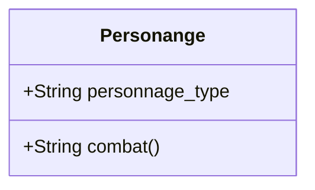

# TP 1 : Retour sur le POO, objets métier et patron de conception *strategy*

> :scream: Comme vous pouvez le constater le sujet de ce TP est  long. Cela ne doit pas vous effrayer. Il mélange explications complètes et manipulations pour être au maximum autosuffisant.
>
> :exclamation: Il est possible que les copiés/collés fonctionnent étrangement (caractère de fin de ligne qui disparaissent, indentation qui change). Faites-y attention !

Dans ce TP vous allez :

- Vous connecter à un cluster
- Découvrir PyCharm, un IDE python
- Découvrir git, un logiciel de versionnage de code source
- Revoir des notions de programmation orientée objet
- Découvrir le patron de conception strategy

## 1 Introduction et mise en place

Dans ce TP nous allons mettre en place la partie *Personnage* de notre jeu en console. Les *personnages* sont des **objets métier** de notre application. Ils représentent informatiquement quelque chose de concret.

> :book:**Objet métier (business object)** : représentation informatique d'un objet "réel" que notre programme va manipuler pour répondre à un besoin. Dans le cas de notre application les *personnage* et les *monstres* sont des objets métier, ainsi que les équipements du personnage. Dans une application de e-commerce par exemple, les articles et comptes sont des objet métier. Ils permettent de séparer les données de l'application et sa logique métier. Ce qui conduit à avoir des objets contenant un minimum de méthodes qui permettent de faire évoluer ces objets.

Ce TP (comme tous les autres) sera réalisé sur le cluster de l'Ensai avec l'IDE (**I**ntegred **D**evelopment **E**nvironment) PyCharm. Vous trouverez sur Moodle la marche à suivre pour vous connecter à cluster depuis votre VM. Vous allez devoir ouvrir 2 connexions SSH :

- Une pour accéder à Pycharm
- Une pour avoir accès à un terminal et exécuté des commandes git

> :book: Git est un logiciel de versionnage de code distribué. J'en parlerais plus longtemps en cours. Pour le moment vous allez réaliser des commandes simples pour récupérer le code du TP et naviguer entre les différentes branches pour obtenir les codes de bases des exercices et leur correction.

Pour obtenir le code du TP tapez les lignes de codes suivante dans un terminal.

> :exclamation: Il y a des risques d'erreurs avec des copiés/collés depuis ce fichier. D'expérience, une bonne méthode d'apprentissage est de taper les commandes à la main. Appuyer sur `Entrée` entre chaque ligne pour valider la commande.

````shell
mkdir 2A
cd 2A
git clone https://gitlab.com/remi2J/complement_info_ensai_2020_2021.git
cd complement_info_ensai_2020_2021
git pull -all
git branch
````

Vous devrait avoir une liste de branche qui apparait dans votre terminal.

> :thinking: Explication des commandes :
>
> - `mkdir 2A` -> création d'un dossier 2A
> - `cd 2A` -> déplacement dans le dossier 2A
> - `git clone ...` -> téléchargement de la branche master du code
> - `git pull -all` -> téléchargement de toutes les branches
> - `git branch` : affichage des branches

Référez vous à la fiche sur moodle pour lancer et configurer PyCharm pour la suite des TP

> :exclamation: Pour ne pas avoir à refaire la configuration du projet PyCharm à chaque TP, vous allez toujours travailler dans le même dossier. Vous téléchargerez les différents codes de base des TP via des *git checkout*. Donc à chaque TP vous retournerez dans le dossier de votre TP.

## 2 Modélisation et implémentation

Avant de coder nous allons réfléchir à la meilleure conception possible pour réaliser nos personnages. Notre conception essayera au maximum de respecter la règle suivante : **faible couplage, forte cohésion**. En d'autre termes nous allons essayer de faire des classes **les plus disjointes possible** (*faible couplage*) pour qu'une modification dans une classe ne nous demande pas de modifier les autres tout en essayant d'avoir **les tâches réalisées pas une seule classe les plus liées possible** (*forte cohésion*).

> 🧙‍♂️ Il faut garder en permanence cette règle en tête

### 2.1 Typons nos personnages par héritage

Nous savons que notre jeu doit proposer 3 types de personnage, `Magicien`, `Voleur` et `Guerrier`. Nous pourrions modéliser notre personnage de cette façon, avec un attribut personnage_type qui pourra prendre les valeurs magicien, guerrier, voleur.



Voilà le code python associé

```python
MAGICIEN = "magicien"
GUERRIER = "guerrier"
VOLEUR = "voleur"

class Personnage:
    def __init__(self, personnage_type):
        self.type = personnage_type
```

#### Exercice 1 :

 - Codez la méthode `attaque(personnage)` dans la classe `PersonnageService` qui prend en paramètre un personnage et retourne :
   - "Lance une boule de feu" si le personnage a pour type magicien ;
   - "Donne un coup d'épée" si le personnage a pour type guerrier ;
   - "Tire à l'arc" si le personne a pour type voleur
- Codez la méthode `defense(personnage)` dans la classe `PersonnageService` qui prend en paramètre un personne et retourne :
  - "Utilise une barrière magique" si le personnage a pour type magicien ;
  - "Pare avec son bouclier" si le personnage a pour type guerrier ;
  - "Esquive adroitement l'attaque" si le personne a pour type voleur
- Testez votre code en utilisant la classe test_personnage_service. Pour cela il vous suffit de lancer les testes de la classe avec le bouton "play" au niveau de la classe. Si vous avez bien fait les points précédents 3 test doivent être en erreur. Corrigez-les pour avoir tout vos tests au vert.

Maintenant imaginons que dans une mise à jour de notre jeu nous voulons ajouter 10 nouveaux types de personnage. Cela nous demande d'aller mettre à jour tous nos blocs *if/elif/else*. Actuellement nous en avons uniquement 2, un pour attaquer et un pour défendre, mais on peut imaginer avoir plus de comportements spécifiques (déplacement, sort, dialogue etc). Avec l'assurance d'oublier de mettre à jour des blocs. Et donc d'avoir des bugs. Les blocs *if/elif/else* créent donc un fort **couplage** entre notre classe personnage et les services qui vont l'utiliser.

La bonne solution est donc d'utiliser de l'héritage ! Cela donne le diagramme de classe suivant :

````mermaid
classDiagram
	class Personnage {
	 +String phrase_attaque
	 }
	 
	Personnage <|-- Magicien
	Personnage <|-- Guerrier
	Personnage <|-- Voleur
````

et le code python associé:

````python
class Personnage:
    def __init__(self, phrase_attaque,phrase_defense):
        self.phrase_attaque = phrase_attaque
        self.phrase_defense = phrase_defense
        
class Magicien(Personnage):
    def __init__(self):
        super().__init__("Lance une boule de feu","Utilise une barrière magique" )
       
class Guerrier(Personnage):
    def __init__(self):
        super().__init__("Donne un coup d'épée","Pare avec son bouclier"  )
        
class Voleur(Personnage):
    def __init__(self):
        super().__init__("Tire à l'arc","Esquive adroitement l'attaque" )
````

Maintenant pour avoir l'effet d'une attaque il suffit d'appeler l'attribut phrase_attaque du personnage (pareil pour la défense).

````python
def combat(personnage):
    return personnage.phrase_attaque
````

On peut désormais faire autant de personnage que l'on souhaite sans difficulté et risque d'oubli ! Nous allons juste améliorer notre modélisation en créant une méthode `attaque(self)` dans notre personnage. Cette méthode contiendra le code pour calculer les dégâts de l'attaque, et retourne un objet `AttaqueInfo` contenant les dégâts et un texte. 

> :shield: On pourrait faire la même chose avec la défense. Pour alléger les diagrammes nous allons nous concentrer sur l'attaque pour le moment. Nous reviendrons sur la défense à la fin.

> :warning: Note : la flèche avec le label creates doit être en **pointillée**, l'outil que j'utilise refuse de produire la bonne flèche.


````mermaid
classDiagram
	class Personnage {
	 +String phrase_attaque
	 +String phrase_defense
	 +AttaqueInfo attaque()
	 }
	 
	 class AttaqueInfo {
	 +String phrase_attaque
	 +Int degat
	 }
	Personnage <|-- Magicien
	Personnage <|-- Guerrier
	Personnage <|-- Voleur
	Personnage ..> AttaqueInfo  : <<creates>>
````

````python
class Personnage:
    def __init__(self, phrase_attaque,phrase_defense):
        self.phrase_attaque = phrase_attaque
        self.phrase_defense = phrase_defense
        
    def attaque(self):
        """
        Définit le comportement d'une attaque. Doit être implémenté par toutes les classes qui héritent de personnage
        :return: les dégâts purs et le texte de l'attaque dans un objet AttaqueInfo
        :rtype: AttaqueInfo
        """
        pass
        
class Magicien(Personnage):
    def __init__(self):
        super().__init__("Lance une boule de feu","Utilise une barrière magique" )
       
    def attaque(self):
        # code pour calculer les dégâts
        return AttaqueInfo(self.phrase, degat)
    
    
class Guerrier(Personnage):
    def __init__(self):
        super().__init__("Donne un coup d'épée","Pare avec son bouclier"  )
 
    def attaque(self):
        # code pour calculer les dégâts
        return AttaqueInfo(self.phrase, degat)
        
        
class Voleur(Personnage):
    def __init__(self):
        super().__init__("Tire à l'arc","Esquive adroitement l'attaque" )
        
    def attaque(self):
        # code pour calculer les dégâts
        return AttaqueInfo(self.phrase, degat)
````

Voilà une conception souple qui nous permet une évolutivité facile.

### 2.2 Un personnage "pur" n'est-il pas abstrait ?

 On pourrait s'arrêter là mais nous allons allez un cran plus loin en rendant `Personnage` **abstrait**. Cela signifie que l'on ne pourra pas *instancier* un objet qui aura pour seule classe Personnage. Il faudra forcément instancier un objet d'une classe fille. On va ainsi spécifier qu'un objet `Personnage` seul n'a pas de sens, et que seule les classes qui héritent de personne en ont. 

Pourquoi faire cela ? Actuellement la méthode `attaque()` ne produit rien dans la classe Personnage. Donc si un objet qui a la classe `Personnage` venait à être instancié et que l'on appelle `attaque()`, la méthode renverrait `None`. Ce qui pourrait créer une erreur et faire crasher notre jeu, ou pire permettre un comportement anormal non détecté (typiquement ce qui permet de faire des *bugs exploit* dans les jeux vidéo). La solution rapide peut être de remplacer la fonction actuelle par :

```python
class Personnage:
	def attaque(self):
        raise NotImplementedError
```

Si la méthode attaque est appelée sur un objet qui a pour classe `Personnage` ou une classe qui en hérite sans l'avoir redéfini une erreur sera levée que l'on pourra gérer. Mais ce n'est pas propre et demande du travail supplémentaire dans la gestion des erreurs. En plus cela va créer une erreur au *run time* (pendant l'exécution), ce qui ne nous arrange pas. On préfère avoir une erreur au *compile time* (pendant que le code se compile) et donc avant que notre jeu se lance. La bonne méthode est de rentre tout simplement `Personnage` abstrait, et donc de dire qu'il est impossible d'instancier un objet qui est seulement `Personnage`. En plus on va passer un contrat avec les classes filles en les obligeant de définir la méthode `attaque()`. Voilà la nouvelle modélisation :

````mermaid
classDiagram
	class AbstractPersonnage {
	<<abstract>>
	 +String phrase_attaque
	 +String phrase_defense
	 +AttaqueInfo attaque()
	 }
	 
	 class AttaqueInfo {
	 +String phrase_attaque
	 +Int degat
	 }
	Magicien --|> AbstractPersonnage
	Guerrier --|> AbstractPersonnage
	Voleur --|> AbstractPersonnage
	AbstractPersonnage ..> AttaqueInfo  : <<creates>>
````

Et le code associé (je vais me limiter à une seule classe fille):

````python
from abc import ABC, abstractmethod
class AbstractPersonnage(ABC):
    def __init__(self, phrase_attaque, phrase_defense):
        self.phrase_attaque = phrase_attaque
        self.phrase_defense = phrase_defense
       
    @abstractmethod # décorateur qui définit une méthode comme abstraite
    def attaque(self):
        """
        Définit le comportement d'une attaque. Doit être implémenté par toutes les classe qui hérite de personnage
        :return: les dégâts purs et le texte de l'attaque dans un objet AttaqueInfo
        :rtype: AttaqueInfo
        """
        
class Magicien(AbstractPersonnage):
    def __init__(self):
        super().__init__("Lance une boule de feu","Utilise une barrière magique" )
       
    def attaque(self):
        # code pour calculer les dégâts
        return AttaqueInfo(self.phrase, degat)
````

> :computer: ​ABC (*Abstract Base Class*) est un module python qui permet de créer des classes abstraites. Une classe abstraite doit hériter de ABC. On définit ensuite les méthodes abstraites avec le décorateur *abstractmethod*. Ces méthodes devront être définies dans les classes filles, sinon python ne permettra pas au programme de se lancer.

En procédant ainsi, et avec un IDE tel que PyCharm, si vous définissez une classe qui hérite d'une classe abstraite, il vous signalera que vous devez implémenter des méthodes provenant de la classe mère, et PyCharm vous permettra de les générer facilement avec un `Ctrl+O` (il vous faudra bien évidement remplir le corps des méthodes)

#### Exercice 2 :

- Commiter votre code pour pouvoir le récupérer plus tard

  ````shell
  git add .
  git commit -m "tp1 ex1"
  ````

- Récupérez le code de la branche tp1_ex2 avec un 

  ````shell
  git checkout TP1_ex2
  ````

- En vous basant sur la modélisation précédente et le code fourni, codez  dans le package personnage et dans des fichiers séparés les classes:

  - AbstractPersonnage
  - Magicien
  - Guerrier

- Voleur

  

### 2.3 Gestion des statistiques et composition

Nous allons maintenant voir comment gérer les caractéristiques de notre personnage. La solution évidente est de mettre toutes les statistiques comme des attributs de la classe:

````mermaid
classDiagram
	class AbstractPersonnage {
	<<abstract>>
	 +String phrase_attaque
	 +String phrase_defense
	 +int force
	 +int agilite
	 +int magie
	 +int defense
	 +int point_de_vie
	 +AttaqueInfo attaque()
	 }
	 
````

Mais est-ce réellement une bonne solution ? Nous savons déjà que nous voulons proposer une gestion de l'équipement dans notre jeu. Il y a de forte chance que notre équipement influe sur les statistiques du personnage. Donc cela veut dire que l'on risque d'avoir une modélisation de l'équipement qui ressemble à ça :

````mermaid
classDiagram
	class AbstractPersonnage {
	<<abstract>>
	 +String phrase_attaque
	 +String phrase_defense
	 +int force
	 +int agilite
	 +int magie
	 +int defense
	 +int point_de_vie
	 +AttaqueInfo attaque()
	 }

class AbstractEquipement {
	<<abstract>>
	 +String nom
	 +int force_bonus
	 +int agilite_bonus
	 +int magie_bonus
	 +int defense_bonus
	 +int point_de_vie_bonus
	 }
````

> :mag: Remarquez que je pars du principe que je vais créer une classe abstraite pour les équipements. Cela ne coûte rien et permet un code évolutif et stable.

Si maintenant nous voulons ajouter une nouvelle caractéristique nous allons devoir l'ajouter dans `AbstractPersonnage` et dans `AbstractEquipement`, et potentiellement dans d'autres classes :scream: . Ce qui va sans aucun doute amener à des oublis (surtout si vous développez à plusieurs). Une solution est de faire une classe `Statistique` qui va contenir les différentes statistiques que l'on utilise. On pourra ainsi les utiliser pour nos personnages et pour l'équipement. Et pour cela nos allons utiliser une relation de **composition**

> :book:Une **composition** est une association de type «est composé de» avec une relation de contenance forte. Les vies des objets composants et de l’objet composé sont étroitement liées : ils sont construits et détruits en même temps. Un objet composé ne peut exister sans ses objets composants, et inversement  

Voici le diagramme de classe (tronqué) que l'on obtient

````mermaid
classDiagram
class AbstractPersonnage {
	<<abstract>>
	 +String phrase_attaque
	 +String phrase_defense
	 +AttaqueInfo attaque()
	 }

class AbstractEquipement {
	<<abstract>>
	+String nom
	 }
	 
class Statistique {
	 +int force
	 +int agilite
	 +int magie
	 +int defense
	 +int point_de_vie
}

AbstractPersonnage *--"1" Statistique
AbstractEquipement *--"1" Statistique
````

Une partie du code python associé : 

````python
from abc import ABC, abstractmethod
class AbstractPersonnage(ABC):
    def __init__(self, phrase_attaque, phrase_defense, force, agilite, magie, defense, point_de_vie):
        self.phrase_attaque = phrase_attaque
        self.phrase_defense = phrase_defense
        self.statistique = Statistique(force, agilite, magie, defense, point_de_vie)

class Statistique:
    def __init__(self, force, agilite, magie, defense, point_de_vie):
        self.force = force
        self.agilite = agilite
        self.magie = magie
        self.defense = defense
        self.point_de_vie = point_de_vie
````

#### Exercice 3 :

- Commitez votre code pour pouvoir le récupérer plus tard

  ````shell
  git add .
  git commit -m "tp1 ex2"
  ````

- Récupérez le code de la branche tp1_ex2 avec un 

  ````shell
  git checkout TP1_ex3
  ````

- En vous basant sur la modélisation précédente et le code fourni :
  - Mettez à jour la classe `AbstractPersonnage`
  - Dans le package business_objet implémentez (codez) la classe `Statistique`
  - Créez un package item et implémentez la classe `AbstractEquipement`

À partir de maintenant on peut ajouter autant de nouvelles statistiques qu'on le souhaite, nos personnages et nos équipements y auront accès, plus de risque d'oubli ! :relieved:

### 2.4 Gestion d'équipement et patron de conception *strategy*

Bon maintenant rentrons plus en détail dans la gestion des équipements. Actuellement notre jeu permet un comportement différent en fonction du personnage :

- Le magicien lance des boules de feu
- Le guerrier frappe à l'épée
- Le voleur tire à l'arc

C'est bien, mais ce n'est pas très personnalisable. Notre jeu doit proposer une texte spécifique à chaque équipement. On pourrait alors imaginer une solution comme celle là en utilisant une relation unidirectionnel (le personnage connait l'arme qu'il possède, mais la réciproque est fausse):

````mermaid
classDiagram
class AbstractPersonnage {
	<<abstract>>
	 +AttaqueInfo attaque()
	 }
	 

class AbstractEquipement {
	<<abstract>>
	+String nom
	 }
	 
class Statistique {
	 +int force
	 +int agilite
	 +int magie
	 +int defense
	 +int point_de_vie
}


Magicien --|> AbstractPersonnage
Guerrier --|> AbstractPersonnage
Voleur --|> AbstractPersonnage

AbstractPersonnage *--"1" Statistique
Arme <-- AbstractPersonnage
AbstractEquipement <|-- Arme
AbstractEquipement *--"1" Statistique

````

Puis ensuite on se base sur le nom de l'arme pour déterminer le texte de l'on affiche.

#### Exercice 4 :

- Commiter votre code pour pouvoir le récupérer plus tard

  ````shell
  git add .
  git commit -m "tp1 ex3"
  ````

- Récupérez le code de la branche tp1_ex2 avec un 

  ````shell
  git checkout TP1_ex4
  ````

- En suivant la modélisation précédente :

  - Codez une classe Arme qui hérite `d'AbstractEquipement` dans le package item

  - Mettez à jour la classe `AbstractPersonnage` en ajoutant un attribut arme.

  - Mettez à jour la classe `Magicien` pour que le message retourné par la méthode attaque varie en fonction de l'arme équipée :

    - Si arme.nom == "Baton de feu" : "Lance des boules de feu"
    - Si arme.nom == "Baton de glace" : "Fait tomber des pic de glace"
    - Si arme.nom == "Necronomicon" :"Invoque un Grand Ancien"
    - Sinon levez l'exception `ArmeInterditeException(self,arme)` avec le code suivant `raise ArmeInterditeException(self,self.arme)`

    > :thinking: `raise ArmeInterditeException(self,self.arme)` fait référence à une exception personnalisée. Vous la trouverez dans le code fourni. Elle permet de dire qu'un personnage possède une arme pour lequel il n'a pas la compétence et qu'il essaye de l'utiliser. Ce qui est théoriquement impossible, et signifie qu'il y a eu un problème quelque part. Car même si le code est bien fait et que ce cas ne devrait pas se produire car lors du changement d'équipement on doit vérifie que le personnage à bien le droit de s'équiper de cette arme, une erreur est toujours possible.

  - Testez votre code avec la classe `MagicienServiceTest`. Si vous avez respecté les consignes, seul un test est au vert. Corrigez-le pour que tous les tests passent.

Maintenant si nous avons 100 armes à gérer je vous laisser imaginer le calvaire :scream_cat: . Surtout si on veut permettre plusieurs classes de personnage à utiliser la même arme. Donc cette solution est rapidement ingérable.

> :thinking: De manière général il faut limiter la taille et le nombre imbrication des blocs if/elif/else. Même si la structure est simple elle crée assez rapidement un code dur à comprendre. Dans la mesure possible utilisez les principes de programmation orientée objet pour éviter d'y recourir. Cependant ce n'est pas une structure à proscrire  totalement, il faut juste l'utiliser avec parcimonie. Une règles "au doigt mouillé" est de ce dire que si vous ne pouvez pas avoir l'intégralité du bloc if/elif/else sous les yeux il faut le retravailler.

La solution est du même style que celle utiliser dans [la partie 2.1](###2.1 Typons nos personnage par héritage), on va finalement dire que c'est l'arme qui va contenir le code décrivant son utilisation, et on va ajouter un nouveau niveau abstraction dans notre modélisation

````mermaid
classDiagram
class AbstractPersonnage {
	<<abstract>>
	 +AttaqueInfo attaque()
	 }
	 

class AbstractEquipement {
	<<abstract>>
	+String nom
	 }
	
class AbstractArme {
<<abstract>>
+String description_utilisation
+AttaqueInfo utiliserArme(Statistique stat_pers)
}
	 
	 	 	 
class Statistique {
	 +int force
	 +int agilite
	 +int magie
	 +int defense
	 +int point_de_vie
}

Magicien --|> AbstractPersonnage
Guerrier --|> AbstractPersonnage
Voleur --|> AbstractPersonnage

AbstractPersonnage *--"1" Statistique
Statistique "1"--* AbstractEquipement
AbstractEquipement <|-- AbstractArme
AbstractPersonnage --> AbstractArme
Epee --|> AbstractArme
Baton --|> AbstractArme
Arc --|> AbstractArme
AbstractArme <|-- Couteau
AbstractArme <|-- Lance
AbstractArme <|-- Livre
````

En procédant ainsi on peut créer une grand nombre d'arme facilement, chacune ayant des règles d'utilisation différentes,  et grâce à l'abstraction `AbstractArme` on sait que chaque arme dispose d'une méthode `utiliserArme()`. Cette méthode aura un contenu différent pour chaque arme, mais s'appellera de la même manière pour toute et surtout devra retourner le même type d'objet. Remarquer qu'elle prend en paramètre un objet `Statistique`. Comme la relation qui lie `AbstractPersonnage` à `AbstractArme` et unidirectionnel il faut passer un paramètre qui contient les statistiques du personnage à l'arme. Tout cela permet que même si le code varie, l'utilisation sera la même. Par exemple (pour la lisibilité du code des parties ont été omises):

````python
class AbstractArme(AbstractEquipement):
    def __init__(self, nom, description_utilisation, degat):
        super().__init__(nom)
        self.description_utilisation = description_utilisation
        self.degat = degat
        
    @abstractmethod
    def utiliser_arme(self,stat_pers)
        

class Epee(AbstractArme):
    def __init__(self,nom, description_utilisation):
        super().__init__(nom,description_utilisation, degat)
      
    def utiliser_arme(self,stat_pers)
            degat_inflige = (stat_pers.force*1.1 * self.degat) +  stat_pers.force*1.4
            return AttaqueInfo(self.phrase, degat_inflige)

        
class Baton(AbstractArme):
    def __init__(self,nom, description_utilisation):
        super().__init__(nom,description_utilisation, degat)
      
     def utiliser_arme(self,stat_pers)
            degat_inflige = (stat_pers.force*0.7 * self.degat) +  (stat_pers.magie*1.2 * self.degat)
            return AttaqueInfo(self.phrase, degat_inflige)
            
            
# Et maintenant on peut générer une infinité d'arme toute unique, mais avec un comportement lié à son type.
baton_en_bois = Baton("Baton en bois", "Le lourd bâton de bois s'abat sur le crâne de l'enmemi", 10)
baton_de_fer = Baton("Baton de feu", "Lors de l'impact une explosion de calcine l'adversaire", 35)
epee_purificatrice = Epee("Master sword", "En éclair lumineux s'abatit sur le monstre", 750)
````

Cette solution utilise le *patron de conception strategy*. Les patrons de conception sont des solutions à des problèmes de programmation récurrents. Ils sont indépendants du langage car ils proposent juste la modélisation d'une solution. *Strategy* permet de répondre au problème suivant : **Comment faire pour réaliser différentes opérations à un seul objet et les changer en cours d'exécution ?** Dans notre cas l'objet est le personnage et l'opération est attaquer. Pour ce faire on décide de transférer la responsabilité de l'attaque à l'arme. Maintenant il suffit de donner une arme différente à notre personnage pour changer sa façon d'attaquer.

> :thinking: Je vais revenir rapidement sur "faible couplage et forte cohérence". Dans cette partie on a **découplé** le comportement des armes et des personnages. Dans le code avec la structure if/elif/else c'était bien dans la classe qui hérite de `Personnage` qui définissait le comportement de l'arme, mais cela n'a pas réellement de sens. En effet, pourquoi le personnage devrait définir le comportement de l'arme ? Il est plus logique que ce soit l'arme elle même qui définisse son comportement. Et c'est ce que nous avons fait. Le comportement de l'arme dépend uniquement de l'arme. Et grâce à l'abstraction qu'apporte `AbstractArme` on sait comment appeler une arme. Et on sait ce qu'elle va nous retourner. Quelque soit l'arme ! Il "suffit" maintenant de coder le comportement des armes. Mais il n'y a plus de structure conditionnelle à maintenir. Et cela apporte à terme un gain de temps considérable.
>
> :bridge_at_night: Si vous avez bien suivi en cours, vous avez peut-être le sentiment que le *strategy pattern* est identique au *bridge pattern*. On retrouve la même idée de hiérarchies multiples et de composition d'objet. La différente entre les deux et que *strategy* permet de changer de comportement au *run time*, et pas Bridge. Vous pouvez voir *strategy* comme un raffinement de *Bridge*

D'ailleurs une fois cela fait pour les armes il est facile de le faire pour les armures :

````mermaid
classDiagram
class AbstractPersonnage {
	<<abstract>>
	 +AttaqueInfo attaque()
	 +AttaqueInfo defense()
	 }
	 

class AbstractEquipement {
	<<abstract>>
	+String nom
	 }
	
class AbstractArme {
<<abstract>>
+String description_attaque
+AttaqueInfo utiliser_arme(Statistique stat_pers)
}
	 
class AbstractArmure {
<<abstract>>
+String description_defense
+DefenseInfo utiliser_armure(Statistique stat_pers)
}
	 	 	 
class Statistique {
	 +int force
	 +int agilite
	 +int magie
	 +int defense
	 +int point_de_vie
}

Magicien --|> AbstractPersonnage
Guerrier --|> AbstractPersonnage
Voleur --|> AbstractPersonnage

AbstractPersonnage --> AbstractArmure
AbstractEquipement <|-- AbstractArmure
AbstractPersonnage *--"1" Statistique
Statistique "1"--* AbstractEquipement
AbstractEquipement <|-- AbstractArme
AbstractPersonnage --> AbstractArme
Epee --|> AbstractArme
Baton --|> AbstractArme
Arc --|> AbstractArme
AbstractArme <|-- Couteau
AbstractArme <|-- Lance
AbstractArme <|-- Livre

AbstractArmure <|--Robe
AbstractArmure <|--ArmureLegere
AbstractArmure <|--ArmureLourde
````

#### Exercice 5 :

- Commitez le code que vous avez rédigez pour le moment. Dans le nouveau terminal tapez

  ````shell
  git add .
  git commit -m "tp1 ex4"
  ````

- Récupérez la branche avec le code à améliorer

  ```` shell
  git checkout TP1_ex5
  ````

- En vous basant sur le code fourni pour la gestion des armes implémentez (codez) la gestion des armures.

- Testez votre code avec la classe PersonnageServiceTest

- Enregistrez votre travail 

  ````shell
  git add .
  git commit -m "tp1 ex5"
  ````

  

### 2.5 Conclusion

Vous remarquerez qu'assez rapidement le diagramme de classe à grossit et peut-être que cela vous effraie. Il n'y a pas vraiment de raison. Il est assez facile d'imaginer que plus il y a de classes et plus un code est complexe et qu'une code avec peu de classe est facile. Et ce n'est pas juste car un code avec peu de classe peut être impossible à comprendre[^1]. La complexité de la modélisation ne provient pas du code mais du but recherché. Notre modélisation permet :

[^1]: je ne dis donc pas qu'un code avec beaucoup de classes est simple

- Une gestion souple des types de personnage ;
- Une gestion souple de l'équipement ;
- La génération d'une infinité d'équipement tous différents, mais où les équipements d'un même type possède un comportement commun ;
- De ne pas avoir de redondance de code.

Ce qui est loin d'être triviale. La première solution avec des structures conditionnelles peut sembler simple car une structure *if/elif/else* est facile à comprendre. Mais rapidement on se retrouver avec des centaines de lignes de code sans la moindre plu value et où l'ajout ou la soustraction d'un cas devient un véritable casse tête car il faut partir à la chasse aux modifications. L'architecture proposée, bien qu'imposante au première abord est maintenable (on peut facilement ajouter/retirer des choses) et facile à faire évoluer (ajouter des armes, des armures, une nouvelle pièce d'équipement, des types de personnage etc). 

Pour avoir les corrections des différents exercices faites les commandes suivantes :

- ex 1 : `git checkout TP1_ex1_correction`
- ex 2 : `git checkout TP1_ex2_correction`
- ex 3 : `git checkout TP1_ex3_correction`
- ex 4 : `git checkout TP1_ex4_correction`
- ex 5 : `git checkout TP1_ex5_correction`

Pour retrouver les différentes version de vos travaux  si vous avez bien fait vos commits faites :

- ex 1 : `git checkout TP1_ex1`
- ex 2 : `git checkout TP1_ex2`
- ex 3 : `git checkout TP1_ex3`
- ex 4 : `git checkout TP1_ex4`
- ex 5 : `git checkout TP1_ex5`


## Pour plus d'information

- [Patron de conception Strategy](https://www.codingame.com/playgrounds/10741/design-pattern-strategy/presentation) 
- [Article de blog sur le patern Strategy](https://blog.bitsrc.io/keep-it-simple-with-the-strategy-design-pattern-c36a14c985e9)
- [classe abstratite (java) sur openclassroom](https://openclassrooms.com/fr/courses/26832-apprenez-a-programmer-en-java/21973-creez-des-classes-abstraites-et-des-interfaces)

