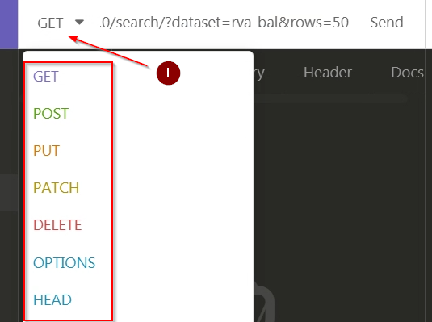
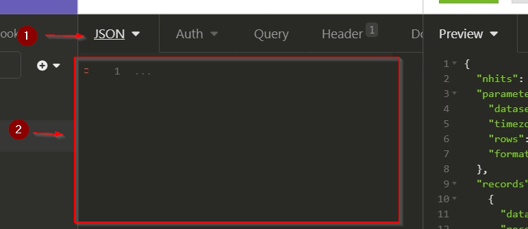
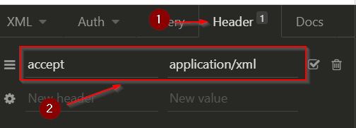

# TP 3 : Webservices et formats de données

> :scream: Comme vous pouvez le constater le sujet de ce TP est lui aussi long. Cela ne doit pas vous effrayer. Il mélange explications complètes et manipulations pour être au maximum autosuffisant.
>
> :exclamation: Il est possible que les copiés/collés fonctionnent étrangement (caractère de fin de ligne qui disparaissent, indentation qui change). Faites-y attention !

Dans ce TP vous allez : 

- Faire des appels à un webservices à la main avec Insomnia
- Faire des appels à un webservice avec la bibliothèque python `requests`
- Manipuler différents formats de données
- Faire un peu de *webscrapping*
- Faire un webservice avec le framework python `Flask-RESTful`

## 1 Introduction et mise en place

### Configuration du proxy dans Insomnia

Pour des questions de sécurité du système d'informatique de l'Ensai, toutes les connexions à internet de l'Ensai passe par un proxy. Vous n'accédez par directement à internet, mais vous accéder à un proxy qui accède à internet pour vous. Il est donc nécessaire de configurer la connexion au proxy. Dans beaucoup d'application c'est déjà fait (par exemple vos navigateurs internet), mais il faut le faire à la main dans Insomnia.

- Lancez Insomnia (Menu démarrer/Tous les programmes/Informatique/Insomnia,/Insomnia, ou avec un recherche directement)
- Bandeau menu du haut / Application / Preferences (ou `ctrl + ,`)
- onglet General/HTTP Network Proxy
- Enable Proxy coché :white_check_mark:
- HTTP Proxy : `http:// pxcache-02.ensai.fr:3128`
- HTTPS Proxy : `http:// pxcache-02.ensai.fr:3128`
- No Proxy : `127.0.0.1`

## 2 Les formats de données du web

Il existe de nombreux formats d'échange sur le web. Dans votre scolarité et vie future voici les trois que vous êtes le plus à même de rencontrer :

- Json (**J**ava**S**cript **O**bject **N**otation) : format clef-valeur simple qui provient du javascript
- XML (e**X**tented **M**arkup **L**anguage) : format de données à balise plus riche que le json. Peut être couplé à un fichier XSD (**X**ML **S**chema **D**efinition) pour connaitre à l'avance le schéma du fichier. Permet la gestion de plusieurs type de données ainsi que l'utilisation d'attribut en plus des données.
- Données tabulaires : CSV (**C**omma **S**eparated **V**alues), TSV (**T**abulation **S**eparated **V**alues).

### JavaScript Object Notation, json

Normalement vous avez tous déjà manipulé des données au format json l'an dernier. Mais voici un petit rappel de leur format :

- C'est un format clef valeur avec chaque couple séparé par une `,`
- Les clefs sont entre `""`
- Les valeurs sont :
  - Des nombres
  - Des strings entre `""`
  - Des arrays encapsulés par des `[]` et chaque valeur séparée par une ,
  - Des objets json encapsulés par des `{}`
  - les booléens `"true"` et `"false"`
  - la valeur `"null"`

Voici un exemple :

```` json
{
    "glossary": {
        "title": "example glossary",
		"GlossDiv": {
            "title": "S",
			"GlossList": {
                "GlossEntry": {
                    "ID": "SGML",
					"SortAs": "SGML",
					"GlossTerm": "Standard Generalized Markup Language",
					"Acronym": "SGML",
					"Abbrev": "ISO 8879:1986",
					"GlossDef": {
                        "para": "A meta-markup language, used to create markup languages such as DocBook.",
						"GlossSeeAlso": ["GML", "XML"]
                    },
					"GlossSee": "markup"
                }
            }
        }
    }
}
````

La proximité syntaxique entre les `dict` python et le format json en fait un format de fichier simple à manipuler en python. En effet à partir de la représentation textuelle d'un json en utilisant la bibliothèque `json` qui est déjà intégrée dans python (donc pas besoin de `pip install`) et la méthode `loads()` on obtient un dictionnaire python. Obtenir un json à partir d'un `dict` se fait avec la méthode `dumps()`. Voici un code exemple.

```python
import json
parsed_json = (json.loads(json_data))
print(json.dumps(parsed_json, indent=4, sort_keys=True))
```

Pour plus d'informations : [Introducing JSON](https://www.json.org/json-en.html)

### EXtented Markup Language, XML

Le XML est une format de données à balise (*tag*). Au lieu d'avoir des couples clef valeur avec des séparateurs génériques, on va encapsuler les données entre des balises. Par exemple :

```json
{
    "clef1" : "value1",
    "clef2" : "value2"
}
```

va devenir : 

````xml
<?xml version="1.0" encoding="utf-8"?>
<container>
    <clef1>value1</clef1>
    <clef2>value2</clef2>
</container>
````

La première ligne est juste un entête XML. Elle contient seulement des méta données, ici la version xml utilisée, et l'encodage des données. Comme le json, le XML permet de gérer des objets encapsuler et des listes :

````xml
<?xml version="1.0" encoding="utf-8"?>
<root>
	<trunk>
    	<branch>
        	<leaf>
            	<name>Une feuille</name>
                <color>verte</color>
            </leaf>
            <leaf>
            	<name>Une feuille</name>
                <color>verte</color>
            </leaf>
        </branch>
        <branch>
        	<color>marron</color>
        </branch>
        <branch>
        	<color>marron</color>
        </branch>
    </trunk>
</root>
````

Il est aussi possible d'ajouter des attributs aux balises directement pour ajouter de l'information :

````xml
<?xml version="1.0" encoding="utf-8"?>
<root>
	<trunk id="1">
    	<branch id="2">
        	<leaf id="3">
            	<name>Une feuille</name>
                <color>verte</color>
            </leaf>
            <leaf id="4">
            	<name>Une feuille</name>
                <color>verte</color>
            </leaf>
        </branch>
        <branch id="5">
        	<color>marron</color>
        </branch>
        <branch id="6">
        	<color>marron</color>
        </branch>
    </trunk>
</root>
````

Il existe un grand nombre de bibliothèque pour gérer du XML en python (pour information [Python and XML](https://wiki.python.org/moin/PythonXml)). Je vous présente seulement [lxml](https://lxml.de/parsing.html), et comment parser du XML, c'est à dire lire les informations contenu dans un fichier XML, pas comment en produire un.

Pour installer la bibliothèque : `pip install lxml`

La première étape est d'importer nos données avec `lxml`

````python
# On importe la classe etree qui est la classe utilisé par lxml pour manipuler notre xml
from lxml import etree

# On lit notre xml qui était sous forme de string précédement
root = etree.XML(xml)
````

Ensuite il faut imaginer que l'on est face à une structure arborescente (car c'est le cas). A partir d'un nœud vous pouvez :

- obtenir son contenu avec l'attribut `text`

- obtenir le nom de la balise avec attribut `tag`

- obtenir ses enfants en considérant qu'un noeud est une liste

  - Donc vous pouvez itérer sur tous les enfants :

    ````python
    from lxml import etree
    
    root = etree.XML(xml)
    
    for child in root :
    	print(child.tag)
    ````

  - Obtenir un enfant en particulier

    ```` python
    from lxml import etree
    
    root = etree.XML(xml)
    
    # Pour obtenir le second enfant
    root[1]
    ````

  - Comme chaque enfant à lui même des enfant on peut faire ces manipulations à partir de n'importe quel nœud.

  En fait si on creuse un peu voici comment notre XML est représenté en terme dans classe par `lxml` (je n'ai pas fait figurer toutes les méthodes)

  ```` mermaid
  classDiagram
  	class Element {
  	+ dict : attrib 
  	+ str : tag 
  	+ str : text 
  	+ list[Element] : getchildren()
  	}
  	
  	Element --* Element
  ````

  À partir d'un élément on peut obtenir les éléments enfants facilement.

Il est possible de faire plus. Il est par exemple possible de parcourir tout un arbre de haut en bas

```python
for element in root.iter():
	print("%s - %s" % (element.tag, element.text))
```

Enfin il est possible d'utiliser le `xpath` pour trouver un/des élément/s particulier. On va spécifier un motif que l'on va chercher dans notre arbre. Par exemple si on veut obtenir toutes les éléments *leafs* qui sont enfant d'une *branch* il faut faire : 

````python
from lxml import etree
xml = #l'arbre 'exemple du dessus
root = etree.XML(xml)
# retourne une liste de tous les noeuds qui respectent cette condition
leafs = root.xpath('//branch/leaf')

for leaf in leafs :
    print(leaf.text)
````

Il existe [d'autres méthodes](https://lxml.de/tutorial.html#elementpath) pour naviguer dans l'arbre xml que le xpath spécifique à `lxml` :

- `iterfind()` qui permet obtenir un itérateur de tous les éléments qui valide nt l'expression passée en paramètre
- `findall()` qui retourne la liste de tous les éléments qui valident l'expression passée en paramètre
- `find()` qui retourne le premier élément qui valide l'expression passé en paramètre
- `findtext()` ri retourne le `.text` premier élément qui valide l'expression passé en paramètre

#### XML et HTML et webscrapping

Les pages web que vos navigateurs affichent sont au format HTML (**H**yper**T**ext **M**arkup **L**anguage). C'est un langage à balise comme le XML et vous allez pouvoir le manipuler et chercher des informations de la même façon. Ainsi si dans le future si vous devez *webscrapper* des informations cela se fera sensiblement comme manipuler un arbre XML.

> :computer: En tout rigueur, le HTML ne suit pas à 100% la norme XML, il est plus permissif sur certain point (pas besoin de fermer certaines balises). C'est un détail qui vaut comme culture informatique, car en général vous pouvez considérer du HTML comme du XML. Dans de rare cas vous allez avoir des erreurs et devoir utiliser un parser HTML et non XML. `lxml` vous permet de faire ça avec `etree.HTML()`.

### Comma Separated Values

Les fichier CSV et autre format tabulaire sont de simples tableaux de données. Vous en avez déjà traité par le passé. On peut utiliser le module python `csv` pour traiter des données CSV.

```python
import csv

fname = "table.csv"
with open(fname, "r", encoding="utf-8") as file
	# Création d'un lecteur pour lire le fichier
    # delimiter : le séparateur entre les différents champs
    # quotechar : le caractère  utilisé pour délimiter les champs avec caractères spéciaux
    reader = csv.reader(file,delimiter=';', quotechar='"')

    headers = []
    data = []
    # Ensuite on itérère sur les lignes. La prmeière contient l'entête alors on la traite différement.
    for row in reader:
        if not headers :
            headers = row
        else :
			data.append(row)
```

Il est possible de lire les données de chaque ligne comme si elles étaient des dictionnaires en utilisant `DictReader` pour accéder aux données non plus avec leur position, mais le titre de la colonnes. Il est possible de donner la liste des colonnes via l'attribut `fieldnames`, mais s'il est omni (ou None) c'est la première ligne du fichier qui sera utilisée.

````python
import csv

fname = "table.csv"
with open(fname, "r",fieldnames=None, encoding="utf-8") as file
	reader = csv.DictReader(csvfile)
	for row in reader:
		print(row['first_name'], row['last_name'])
````

## 3 Appeler un webservice à la main

### Webservices

> :book: **Webservice** : le terme webservice est un terme fourre-tout et il serait compliqué d'en donner une définition exact ([article wikipedia](https://en.wikipedia.org/wiki/Web_service)). Dans le cadre du projet un webservice désigne une application accessible via le protocole HTTP (***H**yper**T**ext **T**ransfer **P**rotocol*) qui respecte l'architecture REST (*REpresentational State Transfer*). 

En d'autres termes, un webservice est une application accessible via le web que l'on va pouvoir requêter soit pour obtenir des ressources, soit pour modifier les ressources accessibles. Un webservice peut seulement avoir pour but d'être une point d'accès unique et normalisé à des données (comme une interface à une base de données), mais il peut également être une manière de contrôler un système d'information (lancer des travaux, les mettre en attente, récupérer des résultats, etc)

Le webservices utilisent le protocole HTTP qui est le protocole du web (et pas d'internet). C'est celui que vous utilisez sans le savoir avec votre navigateur web. Requêter un webservice se fait presque comme requêter une page web. Pour cela il vous faut l'adresse de la ressources, son *Uniforme Resource Identifier*, ou URI (c'est une notion plus général que les *Uniforme Resource Locator*, ou URL), une méthode (GET, POST, PUT, DELETE, [liste des méthodes](https://en.wikipedia.org/wiki/Hypertext_Transfer_Protocol#Request_methods)), et potentiellement des données.

### Exercice 1 : découverte d'Insomnia et premiers requêtes `GET`

- Sur votre machine virtuelle lancez le programme Insomnia (faites une recherche dans le menu démarrer)

- Créer une nouvelle requêter en appuyant sur `crtl+N`, donnez lui le nom que vous voulez, et vérifiez que c'est bien une requête de type `GET` 

  

- Dans la zone de requête testez les requêtes suivantes (l'ordre importe peu) et regardez la réponse dans la partie droite de votre écran. Quelles sont les similarité entre les requêtes et les réponses ?

  

  - [Webservice](https://carbon-intensity.github.io/api-definitions/#carbon-intensity-api-v2-0-0) des sur les émissions carbone du Royaume Uni :
    - `api.carbonintensity.org.uk/intensity`
    - `api.carbonintensity.org.uk/intensity/date/{date}` en remplaçant {data} par la date de votre choix au format YYYY-MM-DD
  - [Webservice](http://www.dnd5eapi.co/docs/#intro) pour obtenir différente info sur Donjon et Dragon 5ième édition
    - `www.dnd5eapi.co/api/classes`
    - `www.dnd5eapi.co/api/classes/{classe}` avec class une valeur de la requête précédente
  - [Webservice](https://data.rennesmetropole.fr/explore/?sort=modified) pour obtenir différent jeu de données ouvert de la ville de Rennes
    - `data.rennesmetropole.fr/api/records/1.0/search?dataset=menus-cantines`
    - Testez différentes valeurs pour dataset :
      - eco-counter-data
      - rva-bal
      - resultats-des-elections-municipales-2020-a-acigne
    - Ajouter à la fin de l'URI le paramètre `rows` et faites varier le nombre de lignes que vous recevez (ajouter simplement &rows=X à la requêter avec X le nombre de lignes)
  - Une méthode du webservice de votre projet

### Méthodes, chemin, paramètres et corps

#### Méthodes

Reprenons les différents éléments d'une requête. Pour le moment vous avez seulement fait des requêtes de type `GET` aux différents webservices. Par convention, ces requêtes sont des requêtes de lecture. Mais il en existe plusieurs autre type :

- `POST` : pour mettre à jour une ressource
- `PUT` : pour créer une ressource
- `DELETE` : pour supprimer une ressource
- `HEADER` : pour obtenir seulement le l'entête HTTP
- Il en existe d'autres

> Ce sont uniquement des conventions, rien empêche (sauf le bon sens) de faire un webservice où une requête `DELETE` ajouter une ressource.

Vous pouvez changer la méthode de la requête avec le menu déroulant à gauche de l'URL de la requête :



>  :computer: Les méthodes qui vont vous servir le plus seront sûrement les méthodes `GET` pour lire des ressources et `POST` pour mettre à jour des ressources.

#### Chemin

Le second élément de votre requête est le chemin vers la ressources. Par exemple `www.dnd5eapi.co/api/classes`. Il est composé de deux parties, le *hostname*, `www.dnd5eapi.co`,  et le *path*, `api/classes`. Le host désigne le nom "humain" de la machine que vous contactez. Ce nom sera converti en adresses IP pour avoir le nom "informatique" de la machine par une requête à un serveur DNS (**D**omain **N**ame **S**erveur). Le *path* est la localisation de la ressource sur la machine. Le *hostname* et le *path* sont séparés par un `/`

En d'autres terme `www.dnd5eapi.co/api/classes` fait référence à une ressource héberger sur la machine qui a pour nom `www.dnd5eapi.co` et qui se situe derrière le chemin `api/classes` accessible via la méthode `GET`. Un peu comme un système de fichiers arborescent, on peut trouver des ressources dans d'autres ressources. Par exemple `www.dnd5eapi.co/api/classes/druid`. Ici on demande spécialement la ressources `druid`et pas la liste des classes disponibles

#### Paramètres

Le troisième élément de la requête sont les paramètres. Ils sont séparées du couple *hostname*+*path* par un `?`. Par exemple : `data.rennesmetropole.fr/api/records/1.0/search?dataset=menus-cantines`. Ici vous faite une requête à la ressource suivante `data.rennesmetropole.fr/api/records/1.0/search`et vous passez en paramètre la clef `dataset` et la valeur `menu-cantines`. Pour ajouter plusieurs paramètres à une requête on les met les uns à la suite des autres séparés par des `&`.

#### Corps

Il est également possible d'ajouter un corps à votre requête. Si dans les requêtes de lecture c'est souvent inutile, pour des requêtes de modification de données cela sera nécessaire. Vous pouvez ajouter un corps à votre requête via la partie centrale d'Insomnia



Dans l'image ci-dessus j'ai sélectionner le corps "json" pour pouvoir écrire des données au format json. Le contenu du corps va dépendre de la requête que vous voulez faire alors allez lire la documentation du webservice de votre projet pour savoir quoi faire.

### Exercice 2 : requêtes avancées

- Avec Insomnia faite une requête avec la méthode `GET` sur la ressource suivante : `web-services.domensai.ecole:500. Qu'obtenez vous ?

- Avec Insomnia faite une requête avec la méthode `GET` sur la ressource suivante : `web-services.domensai.ecole/monsters/{nom}`en remplaçant `{nom}` par une valeur d'un nom que vous venez de récupérer. Qu'obtenez vous ?

- Avec Insomnia faite une requête avec la méthode `GET` sur la ressource suivante : `web-services.domensai.ecole/monsters?q={nom}`en remplaçant `{nom}` par une valeur d'un nom que vous venez de récupérer. Qu'obtenez vous ?

- Avec Insomnia faite une requête avec la méthode `GET` sur la ressource suivante : `web-services.domensai.ecole/monsters?q={id}`en remplaçant `{id}` par une valeur d'un nom que vous venez de récupérer. Qu'obtenez vous ?

- Faites une requête de type PUT sur la ressource suivante `web-services.domensai.ecole/monsters/{nom}`en remplaçant `{nom}` par une valeur de votre choix et avec comme base pour le corps le json ci-dessous. Remplacer toutes les valeurs par ce que vous souhaitez.

  ````json
  {
      "description": "une super description",
      "type_monstre": "un super Type",
      "points_de_vie": 0,
      "force": 0,
      "magie": 0,
      "agilite": 0,
      "defense": 0
  }
  ````

  

- Faites une requête `GET` sur la ressource suivante `web-services.domensai.ecole/monsters/{nom}` en remplaçant `{nom}` par la valeur que vous avez mis précédemment.

- Faites une requête `GET` sur la ressource suivante `web-services.domensai.ecole/monsters/{nom}` en remplaçant `{nom}` par la valeur du nom du monstre qu'une autre personne de la salle à crée

- Faites une requête `POST` sur la ressources `web-services.domensai.ecole/monsters/{nom}`en remplaçant `{nom}` par le nom de la ressource que vous avez crée et en passant en corps de votre requête un json s'inspirant du json ci-dessous

  ````json
  {
      "nom" : "un super nom",
      "description": "une super description",
      "type_monstre": "un super Type",
      "points_de_vie": 0,
      "force": 0,
      "magie": 0,
      "agilite": 0,
      "defense": 0
  }
  ````

- Faites une requête `GET` sur la ressource `web-services.domensai.ecole/monsters/{nom}`. Que c'est-il passé ?

- Même si par défaut ce webservice vous envoie des données au format json, il est possible de demander des données au format xml (e**X**tented **M**arkup **L**anguage). Pour ce faire vous allez ajouter un `header` à la requête : `accept : application/xml`

  
  
  Faite une requête avec la méthode `GET` sur la ressource suivante : `web-services.domensai.ecole/monsters`. Vous devriez avoir une réponse au format XML

## 4 Appeler un webservice en python

### La base du requêtage avec la bibliothèque `requests`

Comme dit plus haut, les plus grands consommateurs de webservices sont les machines. Et donc maintenant nous allons voir comment automatiser des appels à un webservice en python.

> :mag: Aujourd'hui beaucoup d'application web (par exemple Facebook, Netflix, Dailymotion, Uber) utilisent ce que l'on appelle des architecture "micro services". Les échanges entre leurs composants applicatif (par exemple entre leurs IHM et leurs services internes) se font via des webservices. Cela permet d'avoir des modules découplés les uns des autres car ils communiquent uniquement via requête HTTP. Ils ont seulement à savoir comment ils doivent communiquer les uns avec les autres et pas le fonctionnement interne des autres modules.

Le principe va rester le même que faire une requête à la main, et on va utiliser la bibliothèque `requests` (voir [documentation](https://requests.readthedocs.io/en/master/) pour plus d'info) pour avoir seulement à remplir les parties intéressantes de nos requêtes.

Pour faire une requête `GET` vous allez seulement devoir faire :

````python
r = requests.get("http://example.org") # remplacez mon.url.com par un des exemples précédants
````

Exécuter cette ligne de code va :

1. Envoyer la requête au serveur que vous contacter
2. Récupérer la réponse (ie le volet de droite d'Insomnia)

Cette réponse est contenu dans l'objet retourné par la fonction. Comme tout objet python il dispose d'attributs, et il va falloir appeler les bons pour lire le résultat.

Vous pouvez faire

- `r.text` pour obtenir le corps du résultat tout forme de string en laissant `requests` inférer l'encodage (cela fonctionne souvent). Problème vous avez seulement un string, et ce n'est pas le meilleur format de données à manipuler

- `r.content` pour obtenir le corps du résultat comme des octets. Si vous faite un `print` vous allez bien avoir du texte (préfixé par `b'`) mais vos données ne seront pas sous forme de string. À moins d'avoir un cas d'utilisation très particulier (récupération d'image), cela ne vous servira pas

- `r.json` pour obtenir le corps du résultat comme un `dict`. C'est ce que vous allez faire le plus souvent car le format json est un format simple à manipuler

- `r.status_code` pour obtenir le statu de la requête. Voici différent statut que vous pouvez rencontrer:

  - 200 : retour général pour dire que tout c'est bien passé
  - 201 : document crée avec succès
  - 202 : requête accepté, sans garantie du résultat (par exemple dans un système asynchrone)
  - 400 : erreur de syntaxe dans la requête
  - 401 : erreur, une authentification est nécessaire
  - 403 : la ressource est interdite (droit insuffisant)
  - 404 : ressource non trouvée
  - 405 : une mauvaise méthode http a été utilisée
  - 500 : erreur côté serveur
  - 503 : service temporairement indisponible

  Pour résumer, un résultat différent de 2XX indique qu'il y a eu un problème

- `r.encoding` pour obtenir l'encoding de votre requête (utile en cas de problème d'encoding)

En général la méthode qui vous intéresse est la méthode `r.json()` pour obtenir un résultat facilement manipulable. Mais tester le statut de la requête avec `r.status_code` peut être un moyen de détecter des erreurs et les traiter pour éviter que votre application ne plante.

### Les requêtes plus complexes

Pour le moment nous nous sommes concentrer sur les requêtes `GET` mais il est bien sûr possible d'en faire d'autre. Par exemple pour les requêtes `POST`, `PUT `ou `DELETE` voici la syntaxe :

````python
post = requests.post("http://example.org", json = {'key':'value'})
put = requests.put("http://example.org", json = {'key':'value'})
delete = requests.delete("http://example.org")
````

Comme vous le voyez, les syntaxe sont très proches de la syntaxe de la méthode `GET`. On a seulement ajouté pour certaines requêtes des données. C'est ce que vous avez fait plus tôt avec Insomnia. Pour passez des paramètres à votre requête je vous conseille néanmoins de préférer ce genre de code :

````python
url = "http://example.org"
data = {'key':'value'}
post = requests.post(url, json = data)
````

(c'est la même chose fonctionnellement, mais il vaut mieux définir les éléments hors de la requête pour ne pas se perdre)

Normalement si vous utiliser le cluster de l'Ensai ou votre propre machine, vous n'avez pas de problème de proxys. Par contre si vous coder depuis votre VM (ce que je vous déconseille fortement !) il faut ajouter un paramètre proxy à la requête  :

````python
proxies = {
  'http': 'http:// pxcache-02.ensai.fr:3128',
  'https': 'http:// pxcache-02.ensai.fr:3128',
}
requests.get('http://example.org', proxies=proxies)
post = requests.post("http://example.org", json = {'key':'value'},proxies=proxies)
put = requests.put("http://example.org", json = {'key':'value'},proxies=proxies)
delete = requests.delete("http://example.org",proxies=proxies)
````

Il est également possible de passer des entêtes http en ajoutant l'attribut `headers` à la fonction utilisée

```` python
headers = {'accept': 'application/xml'}
requests.get('http://example.org', headers=headers)
post = requests.post("http://example.org", json = {'key':'value'},headers=headers)
put = requests.put("http://example.org", json = {'key':'value'},headers=headers)
delete = requests.delete("http://example.org",headers=headers)
````

### Exercice 3 : Appeler un webservice en python et manipuler du json et du xml

- Ouvrez deux connexions vers le cluster de calcul de l'Ensai, une pour git et une pour pycharm

- Dans la fenêtre pour git accédez au dossier de votre code et récupérez le code de exercice avec un 

  ```` shell
  git checkout TP3_ex3
  ````

- Le code à un peu évolué depuis la dernière fois pour permettre la gestion des monstres. 

  > Les changements n'ont pas une grande importance pour ce TP, mais ils sont intéressants pour le projet. En effet si vous regardez le code en détail j'ai ajouté une nouvelle classe abstraite `Element` dont héritent les montres et les personnages car ils ont des attributs similaires. J'ai ajouter également des méthodes pour accéder facilement aux statistiques des personnages en utilisant les annotations `@property` et `@attribut.setter`. Elles vous permettent de définir des fonctions mais auxquelles on peut accéder comme des attributs. Voici une explication plus complète [tuto decorateur property](https://www.tutorialsteacher.com/python/property-decorator). 

- Assurez vous que les tests unitaires fonctionnent (il vous faudra peut-être modifier le fichier pour configurer votre connexion à la base de données)

- Dans le fichier `monstre_client` codez les méthodes suivantes :

  - `get_liste_monstres` qui retourne la liste de tous les monstres disponibles
  - `get_all_info_form_monstre` qui prend en paramètre un monstre et va chercher toutes les informations disponible sur ce montre et met à jour l'objet python
  - `create_montre` qui prend un monstre en paramètre et va créer une nouvelle ressource dans notre webservice
  - `update_montre` qui prend un montre en paramètre et va modifier la ressource associé dans le webservice

  > :bulb:  Pour obtenir les informations intéressantes de la requête il vous faut utiliser la méthode `json()` sur le résultat de votre requête si le webservice vous envoie des données au format json. Elle vous retourne une dictionnaire python. Pour obtenir l'information que vous souhaitez vous devez appeler la clef associée.

- Si vous avez du temps : dans le fichier `monstre_client` codez la méthode `get_liste_monstre_from_xml` qui retourne la liste de tous les monstres disponibles en demandant la liste au format xml.

  > :bulb: Voici les choses à faire 
  >
  > - Ajouter l'entête : `{"accept" : "application/xml"}`
  >
  >  - Traiter la réponse comme un string
  >  - Utiliser la bibliothèque `lxml` pour parser la réponse de la requête
  >  - Pour obtenir la liste des monstres, utilisez la méthode .`xpath('/response/result')` sur les données parsée avec `lxml`


### Exercice 4 : un peu de webscrapping

> :bookmark_tabs: Cet exercice est un exercice purement technique, qui ne répond à aucun besoin de l'

- Créez un fichier `webscraping.py` a la racine du projet
- Aller récupérer tout les titres de la page [wikiepdia webscrapping](https://fr.wikipedia.org/wiki/Web_scraping)

    > :bulb: Un peu d'aide
    >
    > - Contacter une page se fait avec une requête HTTP `GET`
    > - Les titres sont contenus dans les balises h1, h2, h3, h4, h5, h6
    > - Pour obtenir le contenu d'une balise vous pouvez faire `etree.tostring(header)` avec header un objet de l'arbre XML
    > - Vous pouvez utiliser de manière indifférencier dans cette exemple les méthodes `etre.XML()` et `etree.HTML()` pour parser le document, bien qu'en toute rigueur ce soit la fonction `etree.HTML()` qu'il faudrait utiliser

## 5 Pour allez plus loin : coder un webservice en python

Avec les outils à disposition aujourd'hui il est facile de faire un webservice soit même. La couche la plus compliqué à faire d'un point de vu technique est l'interface avec l'extérieur pour accepter les différentes requêtes les aiguiller vers la bonne méthode, mais il y a des *frameworks* python qui font ça pour nous.

Il y a deux leaders sur le marché actuellement pour faire un webservice REST : [Django REST](https://www.django-rest-framework.org/) et [FlaskRESTful](https://flask-restful.readthedocs.io/en/latest/). Rapidement Django est très bien pour faire une application robuste en entreprise et Flask pour faire un webservice en 5min en TP.

>  Pour plus d'info : :crossed_swords::rowboat: [Pirates use Flask, the Navy uses Django](https://www.reddit.com/r/learnpython/comments/33izzn/pirates_use_flask_the_navy_uses_django/):anchor: 

Voici le code minimal d'un webservice REST avec Flask ([documentation officielle](https://flask-restful.readthedocs.io/en/latest/quickstart.html#a-minimal-api))

```python
from flask import Flask
from flask_restful import Resource, Api

# Déclaration de notre webservice
app = Flask(__name__)
api = Api(app)

# Une classe qui hérite de Ressource. Cela va nous permettre de centraliser facilement les méthodes d'une même URL
class HelloWorld(Resource):
    # On définit le comportement lors d'un appel à cette ressource avec une méthode GET
    def get(self):
        return {'hello': 'world'}

# Ajout de la ressource au webservice
api.add_resource(HelloWorld, '/')

# Code pour lancer le webservice
if __name__ == '__main__':
    app.run(debug=True)
```

Appeler la ressource "/" du webservice va retourner le json `{'hello': 'world'}`

Voici un exemple plus complet inspiré de la [documentation officielle](https://flask-restful.readthedocs.io/en/latest/quickstart.html#resourceful-routing)

````python
from flask import Flask, request
from flask_restful import Resource, Api

app = Flask(__name__)
api = Api(app)

todos = {}

# une ressource avec les méthode get et put
class TodoSimple(Resource):
    def get(self, todo_id):
        return {todo_id: todos[todo_id]}

    def put(self, todo_id):
        todos[todo_id] = request.form['data']
        return {todo_id: todos[todo_id]}
    
    
# une ressource avec la méthode get
class Todo1(Resource):
    def get(self):
        # Default to 200 OK
        return {'task': 'Hello world'}

# On permet la gestion dynamique des ressources
api.add_resource(TodoSimple, 'todo/<string:todo_id>')

api.add_resource(Todo1, '/todo1')


if __name__ == '__main__':
    app.run(debug=True)
````

Fondamentalement un webservice est une application comme les autres, mais au lieu d'avoir une interface graphique comme on en a l'habitude en tant qu'humain, l'interface est une interface HTTP qui va accepter des requêtes et envoyer des résultats. Ainsi le diagramme de séquence des différentes couche qui vont être impliquer dans une requête `GET` pour récupérer une ressource va ressembler à cela si je reprend le modèle 3 couches vu en cours

````mermaid
sequenceDiagram
    participant U as User
    participant R as Resource
    participant S as Service
    participant D as DAO
    participant B as Base de données
    U ->> R : HTTP requête
    R ->> S : get_by_id()
    S ->> D : find_by_id()
    D ->> B : requête SQL (psycopg)
    B ->> D : curseur SQL (psycopg)
    D ->> S : instance objet metier
    S ->> R : instance objet metier
    Note over S,R: l'objet est potentiellement altéré
    R ->> U : Réponse HTTP

````

La seule nouveauté qu'apporte Flask est la colonne `Resource` qui remplace la colonne `Vue` que l'on aurait normalement. La colonne `Service` peut sembler inutile dans cet exemple. Mais dans le cas de récupération complexe de ressources, qui nécessitent par exemple plusieurs requête ou des modifications métiers, avoir une couche intermédiaire est important car c'est elle qui va concentrer toute la logique métier.

### Exercice 5  mon premier webservice


### Exercice 6 : mon webservice avancé (optionnel) 

- Clonez le répertoire git suivant : 

  > :bulb: Ce répertoire contient l'intégralité du code du webservice que vous utilisez depuis le début du TP. Le but de ce code est de vous fournir des ressources pour votre projet et vous aider pour cet exercice.

- Codez la méthode `get` dans le fichier `weapon_resource.py` qui à partir d'un id, retourne l'arme associée en base.

  - La méthode `find_by_id` de la classe ArmeDao est déjà faite, il vous suffit de l'appeler
  - Il vous faut initialiser votre base avec le script d'initialisation dans le fichier `script_bdd.sql `
  - Inspirez vous de ce qui est fait dans `monster_resource.py` 
  - Il vous ajouter une nouvelle ressource dans le fichier `webservice_python_rpg.py` 

- Lancez l'application et regardez ce que vous obtenez avec Insomnia
