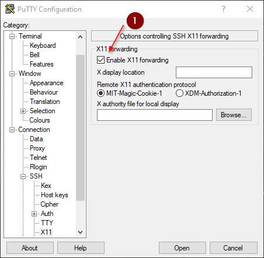
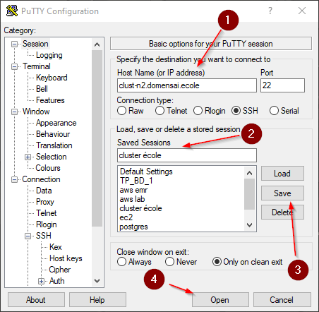
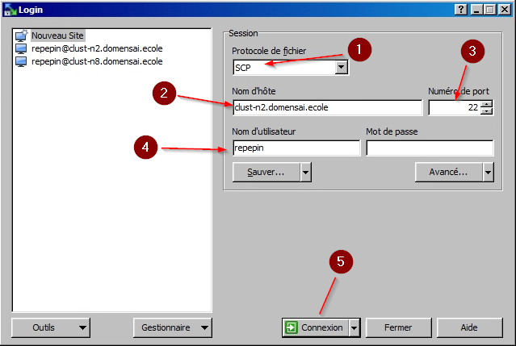
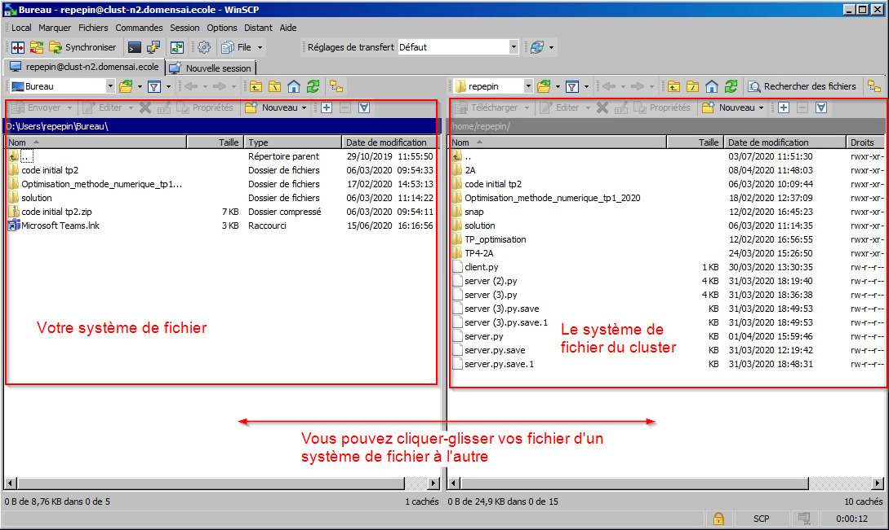

# Se connecter au cluster de calcul pour exécuter PyCharm

Cette note est faite pour vous donner la marche à suivre pour vous connecter au cluster de l'Ensai pour utiliser l'IDE python PyCharm. Cela permet d'alléger les calculs faits sur votre VM, et d'éviter des ralentissement quand vous êtes beaucoup à exécuter PyCharm dessus. PyCharm est un IDE puissant qui vient avec tout une gamme d'outils pour vous aider, mais cela a un coût en Ram et CPU que votre VM a du mal à fournir, surtout si vous êtes nombreux à l'utiliser.

Pour vous connecter au cluster vous allez devoir vous connecter en **SSH** (**S**ecure **SH**ell) qui permet de se connecter de façon sécurisée à un système Unix, Linux et Windows. Pour plus d'information, je vous conseille de lire le début de cette [page web](https://doc.fedora-fr.org/wiki/SSH_:_Authentification_par_cl%C3%A9). 

Si on se limite à une connexion SSH à un serveur on ne dispose pas d'interface graphique. Pour bénéficier de l'interface graphique de PyCharm, et de l'utilisation de la souri, nous allons en plus devoir utiliser **Xming** qui va nous permettre d'avoir une fenêtre graphique pour PyCharm. Même si cette fenêtre sera affichée sur votre ordinateur, tous les calculs tout sont faits sur le serveur de l'Ensai (voyez cela comme du "streaming d'interface")

 Dernier point, comme vous allez travailler sur le serveur de calcul de l'Ensai et pas sur votre VM, vous n'allez pas avoir accès à vos fichiers. Vous allez utiliser **WinSCP** pour transférer vos fichiers entre votre VM et le serveur.

> Il est possible que vous trouvez cela compliqué et inutile car vous pourriez travailler sur votre machine. Mais dans votre vie future (aussi bien dans l'école que dans le monde professionnel) vous allez souvent devoir vous connecter à des serveurs pour exécuter de gros calculs. Plus vous aurez appris tôt à faire cela et plus vous le ferez avec facilité. Il est indéniable que les premières fois seront compliquées car vous découvrez beaucoup de notions, mais après deux-trois fois cela vous semblera assez simple.

- [ ] Lancer Xming
  - [ ] Menu démarrer > barre de recherche > Xming
  - [ ] Cliquer dessus, cela devra faire apparaitre l'icone Xming  en bas à droite
  
- [ ] Copier les fichier du TP sur le cluster
  - [ ] Menu démarrer > barre de recherche > WinSCP
  - [ ] Allez chercher vos fichiers dans la fenêtre de gauche puis copiez sur le cluster à droite
  
- [ ] Se connecter au cluster
  - [ ] Menu démarrer > barre de recherche > PuTTy
  
  - [ ] Menu à gauche, SSH > X11 : enable fowarding
  
    
  
  - [ ] Menu à gauche, Session > Host Name > `clust-n2.domensai.ecole`
  
  - [ ] Saved Sessions : cluster école > save
  
    
  
  - [ ] Open
  
  - [ ] La première fois une fenêtre va s'ouvrir vous demandant si vous connaissez la "fingerprint" du serveur. Validez
  
  - [ ] Dans le terminal qui s'est ouvert, saisissez votre idep et votre mdp. Rien ne s'affichera quand vous taperez votre mdp. C'est normal. Tapez le à l'aveugle puis validez.
  
  - [ ] Vous voilà connecter au cluster et dans votre espace
  
  - [ ] Tapez pycharm-community pour ouvrir PyCharm (utilisez la touche `tab` pour l'autocomplétions et gagner du temps)
  
  - [ ] Vous pouvez également exécuter d'autres commandes comme des commandes git dans ce terminal

- [ ] Copier les fichier du cluster vers votre VM
  - [ ] Menu démarrer > barre de recherche > WinSCP
  - [ ] Dans la fenêtre Login :
    - [ ] Protocole de fichier : SCP
    - [ ] Non d'hôte : `clust-n2.domensai.ecole`
    - [ ] Numéro de port : 22
    - [ ] Nom d'utilisateur : votre idep ensai
    - [ ] Open
  
  
  
  - [ ] Saisissez votre mot de passe dans la fenêtre qui s'ouvre
  
  - [ ] Allez chercher vos fichiers dans la fenêtre de droite puis copiez sur votre VM à gauche
  

