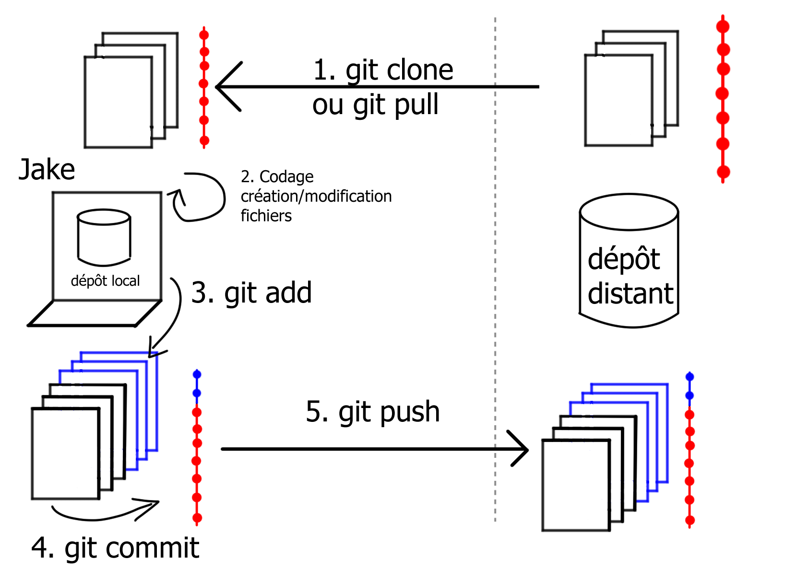
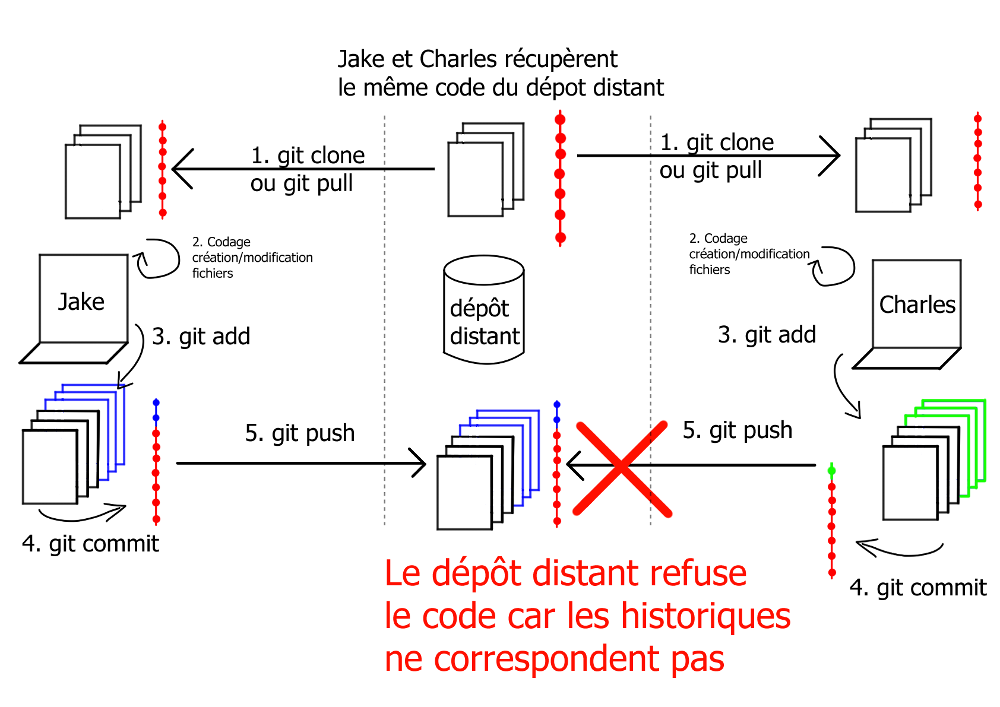
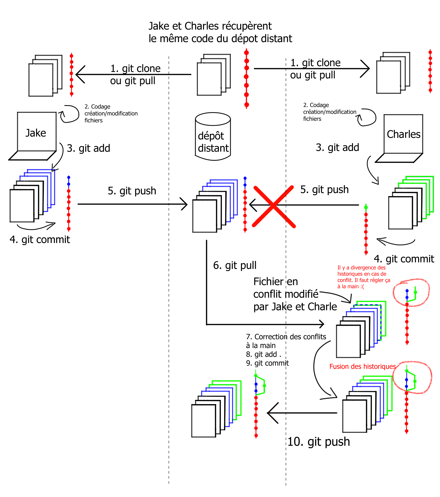

### Le versionnage avec GIT

Ce document couvre les connaissances de bases que vous êtes sensé avoir à la fin de ce cours git. Git est un outil de versionnage de code, « agnostique » au langage utilisé, qui vous servira pour tout vos projets, qu'ils soient Python, R, SAS ou d'un autre langage.

> :hourglass: La lecture du document et des différentes vidéos devrait vous prendre environ une heure et quart. C'est le temps passé l'an dernier pour couvrir les même notions en cours. 
>
> Une fois ce FOAD fait vous devrez tester vos connaissances avec un QCM sur Moodle. Une note de 15/20 est attendue pour le valider, vous pouvez faire ce QCM plusieurs fois. **S'il n'est pas validé, un malus d'un point sera appliqué sur votre note du module.**

### C'est quoi le versionnage ?

Avant de vous présenter git, il faut bien que vous compreniez le besoin derrière la nécessité d'avoir un système de versionnage. Vous avez déjà dû tous travailler sur un projet un peu long, et avoir différentes versions de votre travail. Ou travailler sur un seul dossier collaboratif. Mais ces deux méthodes de travail, bien que facile d'accès ont des limites importantes que je vais essayer de vous présenter avec différentes situations fictionnelles, mais que vous avez peut-être déjà dû croiser (et que vous rencontrerez peut-être dans le futur).

Les protagonistes de ces situations seront :

- Le capitaine Holt, il aura le rôle de "maîtrise d'ouvrage" (= demandeur, client);
- Terry Jeffords, il aura le rôle chef de projet ;
- Amy Santiago, elle aura le rôle de développeuse "full stack" (profil polyvalent qui s'y connait aussi bien en code qu'en architecture);
- Rosa Diaz, elle aura le rôle de développeuse senior;
- Jake Peralata, il aura le rôle de développeur senior ;
- Charles Boyle, il aura le rôle de développeur junior.

Le capitane Holt demande à son équipe de réaliser une application pour automatiser les tâches administrative pour le commissariat du 99ième district de New York. Il met donc ses meilleurs éléments sur ce projet. Au début Amy Santiago avec sa casquette de "full stack" travail encore sur un autre projet et ne participe pas aux premières discussions.

#### Un monde sans versionnage et travail dans un dossier partagé.

Après quelques discussion sur la modélisation du projet l'équipe est prête à commencer le codage. D'après la modélisation l'application est assez simple et devrait être terminée en un mois. Terry laisse son équipe gérer, ce n'est pas le premier projet sur lequel ils travaillent donc ils vont s'en sortir d'après lui, et il se concentre sur la rédaction de notes diverses pour montrer que tout avance bien.


Comme le projet est court, Jake, Rosa et Boyle s'accordent pour créer un dossier un projet sur un serveur partagé et tous travailler dessus. Boyle préviens que ça lui semble une mauvaise idée, mais on lui dit que tout va bien se passer et il n'insiste pas.

Le premier jour se passent bien le projet avance, mais des le lendemain des problèmes arrivent : 

- Quand une personne est en train de travailler sur un fichier, ce fichier se verrouille empêchant toutes autre personne de travailler. Tous les logiciels ne font pas ça, alors l'équipe passe sur un logiciel qui ne verrouille pas les documents ;
- Quand une personne modifie le code d'un fichier se fichier ne fonctionne plus tant que la modification n'est pas terminée et stable. Donc l'équipe va copier coller le dossier sur leur machine, faire les modification et copier/coller les modifications ;
- Cela crée un nouveau problème, par moment des modifications sont effacées lorsque des modification sont collées sur le serveur partagé et il n'y a aucun moyen de revenir en arrière, n'y d'avoir un historique des modifications.

Après une semaine l'équipe passe plus de temps à gérer les problèmes qu'ils génèrent eux même qu'à coder. Lors de la démo de fin de semaine, l'équipe se rend compte que le code sur le dossier ne fonctionne pas ne peut donc rien présenter et le Capitain Holt est très deçu.


Dans le stress de la démonstration, Boyle se souvient qu'il a toujours une version de 2 jours qui fonctionne sur sa machine. La démonstration est partiellement sauvée. Pour éviter que le désastre se reproduisent Terry décide de mettre en place un système de versionnage à la main.

#### Versionnage à la main

À partir d'aujourd'hui l'équipe devra créer une dossier tous les soirs avec un code qui fonctionne. Et voici à quoi rassemble rapidement le dossier partagé.


Après une semaine plus personne ne sais ce que font les différentes versions du code. Et même si cette solution évite de perdre une journée de code cela ne résout pas l'effacement du code des autres dans la workspace. La tension dans l'équipe commence à monter et la bonne ambiance du début se détériore. La confiance entre les membres de l'équipe commence à disparaitre. Et puis l'espace dans le dossier commence à manquer à cause de la duplication du code.

Pour couronner le tout de nouvelles fonctionnalités sont demandées par le Capitaine Holt qui est arrivé à vendre l'application à d'autres districts. D'un petit projet interne avec un niveau de qualité minimal, l'application doit être utilisable dans tous les districts, et chaque district demande quelques fonctionnalités supplémentaires. Une première version de l'application est attendus pour dans 3 mois avec un jeu de fonctionnalité *core* et le reste dans 9 mois. Terry se rend bien compte qu'il faut changer la manière de travailler sous peine de voir le projet échouer et devoir gérer une équipe qui se déteste. Il demande alors à Amy d'apporter son expertise pour aider l'équipe.

#### Git la solution

Venant de terminer un autre projet, Amy ne connait rien au projet en cours. Elle demande alors une petit réunion pour qu'on lui présente le projet et les outils utilisés. L'équipe utilise Pycharm ou VScode comme IDE, ce qui lui convient, et quand on lui montre le dossier avec les 20 versions du code sans réel *change log* elle comprend rapidement pourquoi le projet n'avance pas.


Le problème c'est qu'elle est face à elle 2 développeurs senior qui n'aiment pas qu'on critique leur façon de faire. Au lieu de présenter directement le *workflow* qu'elle avait mis en place sur son précédent projet, elle va commencer par demander une semaine où personne ne travaille sur le projet pour demander une formation git et organiser une journée sous forme de jeu avec git ([jeu avec git](https://learngitbranching.js.org/?locale=fr_FR)).

Après une prise en main compliquée et quelques couacs, le projet avance bien, et les tensions diminuent. De mauvaise pratiques persistent et des conflit de code se produisent, mais Amy arrivent à régler les problèmes. Le projet est sauvé.

Je vais arrêter notre histoire ici pour la reprendre plus tard et proposer un épilogue.

Ce que vous devez en retenir :

- **Travailler dans un fichier collaboratif pour rédiger du code est une très mauvaise idée !** Il est impossible de travailler à plusieurs mains en même temps dans cette configuration. En effet dés que quelqu'un tape du code le code ne peut pas fonctionner tantque cette personne n'a pas terminée. Et même une fois qu'elle a lâché le clavier, le code ne va sûrement pas fonctionner du premier coup. C'est pour cela qu'il n'existe pas de service comme google doc ou overleaf pour rédiger du code de façon synchrone. **Pour pouvoir faire du code à plusieurs vous devez absolument le faire de manière asynchrone.**
- **Si pour des petits projets scolaires ne pas avoir d'historique n'est pas un gros problème, c'est impensable pour un gros projet d'entreprise qui dure plusieurs années**. Cela permet de faire des retours en arrière rapides en cas d'erreur grave et d'avoir une trace de ce qui a été fait. Dans ce contexte faire un *change log* avec les modifications entre les versions est un plus pour savoir jusqu'à où remonter en cas d'erreur.
- Cette fiction ne permet pas de le montrer, mais git (ou tout autre système de gestion de code source décentralisé) ne doit pas rester la propriété des développeurs. Si vous faites du code R, SAS, Julia ou tout autre langage vous pouvez (et devez) utiliser git pour versionner votre code !
- N'essayez de réinventer un système de versionnage du code avec une organisation maison du travail !!!

### Git, un système de versionnage

Git  est un logiciel de versionnage de code source. Il repose sur une **architecture décentralisée**. Il a été créé par [Linus Torvalds](https://fr.wikipedia.org/wiki/Linus_Torvalds), pour gérer les contributions au [noyau Linux](https://fr.wikipedia.org/wiki/Noyau_Linux). Le fonctionnement de git est loin d'être trivial, et le coût d'entrée est loin d'être nul. Mais il est très largement utilisé en entreprise et ne pas savoir comment git fonctionne est aujourd'hui un défaut pour un data scientist.

> 🧙‍♂️ git signifie "connard" en argot britannique. Oui Linus Torvalds est un être adorable =)

L'architecture de git est une architecture [*peer-to-peer*](https://fr.wikipedia.org/wiki/Pair_%C3%A0_pair) même si en général on va donner un rôle différent à un des nœuds du système qui va être le serveur où tout le monde récupère et pousse le code. Ce serveur est appelé le serveur le [*remote*](https://git-scm.com/book/en/v2/Git-Basics-Working-with-Remotes) ou dépôt distant ou dépôt central. Mais si le fait d'avoir ce serveur est une facilité car tout le monde va se connecter à ce serveur pour récupérer et pousser du code, il faut bien comprendre **quand vous récupérez du code avec git vous allez avoir un dépôt local sur votre machine qui va contenir l'intégralité de l'historique git**. Donc si le dépôt distant venait à disparaitre, vous aurez toujours sur votre machine tout l'historique du code que vous pourrez déposer sur un nouveau dépôt distant. **Donc vous ne pouvez pas perdre de code déposé sur le dépôt distante suite sa disparition.**

#### L'historique git

Cette notion d'historique est vraiment le cœur de git, et une fois compris comment fonctionne l'historique vous aurez compris la majeure partie de git. L'historique de git ne contient pas l'intégralité des modifications que vous avez effectuez sur votre, vous n'allez pas pouvoir faire des sortes de `crtl+z` pour rapidement retourner à une version privée de la dernière lignes que vous avez modifié, mais des *snippets* (extraits) que vous aurez choisi.

En effet c'est vous qui allez devoir construire "à la main" l'historique git. Quand vous considérerez que votre code mérite d'être historisé (fin de journée, vous venez de terminer une fonctionnalité etc) vous allez faire un *commit*. C'est à dire prendre le code que vous voulez historiser et le mettre dans l'historique. Mais votre historique n'est pas forcément un enchainement linéaire de *commits* et par moment vous pouvez faire diverger votre code pour ensuite le refaire converger. Cela peut être volontaire en faisant des branches ou involontaire en travaillant à plusieurs et en créant des conflits.


Vous l'aurez compris l'historique va contenir beaucoup d'informations. Et pour éviter de prendre une place considérable, git ne fonctionne que par différence. Quand vous allez faire un *commit*, ce n'est pas le code que vous ajoutez que git va mémoriser, mais le différentiel entre ce *commit* et le *commit* précédent. Comme ça pas de duplication inutile de code.

#### Git workflow

Parlons un peu plus en détail du *workflow* de git. Car pour bien utiliser git vous allez devoir faire plusieurs commandes dans un certains ordres précis. Voici un petit enchainement qui permet de récupérer le code du serveur distant, le modifier, et envoyer vos modification sur le serveur.

1. Du code source est présent sur le serveur distant. Un utilisateur (Jake) va cloner le code du serveur distant sur sa machine avec l'instruction `git clone` ([documentation](https://git-scm.com/docs/git-clone)) si c'est la première fois qu'il récupère le code ou un `git pull` ([documentation](https://git-scm.com/docs/git-pull)) s'il veut seulement récupérer la dernière version du code car il possède une version ancienne. **Il va récupérer le code courant mais également l'intégralité de l'historique du code sur sa machine** ;
2. Il va ensuite faire des modifications sur le code;
3.  Pour que git les prennent en compte il va devoir faire `git add file1.py file.py` (si les fichiers modifiés sont file1.py et file2.py) ([documentation](https://git-scm.com/docs/git-add)). Il peut également faire `git add .` ou `git add --all` pour que git prennent en compte tous les fichiers modifiés ;
4. L'étape suivante est de faire une `git commit` ([documentation](https://git-scm.com/docs/git-commit)) cela va créer une nouvelle entrée dans historique git. Le code est pour le moment uniquement présent sur la machine de Jake ; 
5. Enfin Jake va faire un `git push` ([documentation](https://git-scm.com/docs/git-push)) pour pousser son code sur le dépôt distant et le rendre accessible à tout le monde.




Une chose à comprendre pour bien utiliser git est la notion de cycle de vie de vos fichiers. En effet il ne suffit pas de modifier une fichier et de le pousser (*push*) sur le serveur distant pour que ce fichier soit accessible à tous. Il y a plusieurs étapes à faire dans le bon ordre. 

##### Fichier existant

Le premier cas et le plus courant et quand vous allez mettre à jour un fichier dans votre *workspace*. Comme git à déjà connaissance du fichier il va détecter qu'il a été modifié car son *hash* (résultat d'une fonction de hachage) sera différent. Mais sans action de votre part il ne va rien faire (il faut bien comprendre que git ne fait que ce que vous lui dites). En faisant un `git add votreFichier` vous allez placer votre fichier dans une zone tampon appelée *staging index* ou *stating area*. Rien de vous empêche de continuer à modifier votre fichier, mais il faut bien comprendre à partir de là, deux versions de votre fichier existent, celle de votre *workspace* et celle de votre *staging index* (qui vous est cachée, mais si besoin vous pouvez récupérer cette version). Vous pouvez également modifier d'autres fichier et les mettre dans le *staging index*. 

Une fois le travail en cours terminé, vous allez faire un *commit*, c'est à dire prendre le contenu de votre *staging index* et créer une nouvelle entrée dans l'historique git avec. Pour faire un commit il faut taper `git commit -m "message de commit"` (avec "message de commit" un court message explicatif entre " " qui explique le contenu du *commit*). En plus d'ajouter une entrée dans l'historique, git va considérer vos fichiers comme *Unmodified*. En effet votre fichier est désormais cohérent avec la version la plus récente de l'historique donc pour git il est désormais *Unmodified*. Par contre pour le moment ce fichier (et les autre que vous avez *commit*) sont toujours que sur votre ordinateur dans votre dépôt local.

##### Nouveau fichier

Dans le cas d'un nouveau fichier les commandes vont être les même, mais la philosophie derrière va être un peu différente. En effet quand vous créez un nouveau fichier, git n'a pas connaissance de ce fichier. Si vous ne lui dites rien, il ne va rien faire avec. Il va bien détecter que le fichier est nouveau, mais comme il n'a aucune information dessus il ne peux rien dire d'autre. Pour dire à git de suivre (*track*) ce fichier vous allez devoir faire également un `git add monFichier` ce qui va le mettre dans votre *staging index* et en plus git va commencer à avoir des informations, donc si vous remodifiez votre fichier à partir de maintenant git va détecter que vous avez juste modifié le fichier. La suite du processus est la même.

Voici un diagramme tiré de la documentation officiel de git qui résumer tout cela  ([source](https://git-scm.com/book/en/v2/Git-Basics-Recording-Changes-to-the-Repository)):


> 📖 En parlant de la documentation de git : git est l'un des sujets les plus documentés que je connaisse. Si vous êtes bloqués un jour faites une recherche sur le web et vous trouverez sûrement la solution à votre problème. 

##### Et avec le dépôt distant

Une autre manière de voir le *workflow* de git est ne plus regarder le statut des fichiers mais comment passer d'une zone git à l'autre ([source](https://nceas.github.io/sasap-training/materials/reproducible_research_in_r_fairbanks/version-control-with-git-and-github.html)): 


On va partir de votre zone de travail (*workspace*). Au fur et à mesure de votre progression vous allez *stage* des fichiers et les envoyer dans le *staging index* avec des `git add`. Puis quand vous avez un code qui tourne (ou quand vous voulez) vous allez le *commit* pour créer une entrée dans votre historique local avec un `git commit`. Et enfin si vous souhaitez envoyer votre code sur le serveur distant vous allez faire un `git push`. Et si vous voulez récupérer le code du serveur distant vous allez faire un `git pull` pour tout récupérer et mettre à jour votre *workspace* ou un `git fetch` pour simplement récupérer le code du dépôt distant sans modifier votre *workspace*, puis un `git merge` pour mettre à jour votre *workspace* (dans certain cas procéder en deux temps est une meilleur solution qu'en un temps).

Pour le moment git nous permet d'avoir un historique de notre code et avec on peut retourner en arrière à tout moment. Je ne vais pas trop rentrer dans les détails, mais **l'historique de git est assez dur à altérer donc il n'y aucun risque qu'une version précédente du code ne soit perdue.**

##### Et à plusieurs ?

Depuis le début je fait comme si une seule personne travaillait sur un dépôt de code, ce qui n'arrive presque jamais, et en général plusieurs personnes travail en parallèle sur le même code. Et comme git repose sur sur une architecture décentralisée asynchrone, plusieurs version de votre application vont exister à un même moment :

- Celle du dépôt distant ;
- Celle de chaque dépôt locaux sur les ordinateurs des différentes personnes qui ont récupéré le code.

Et cela va potentiellement générer des conflits. Par exemple si Charles et Jake récupèrent le même code mais que Jake *push* le premier lorsque Charles va vouloir push sont code il va avoir une erreur.



Et cette erreur va être : 

````
 ! [rejected]        master -> dev (fetch first)
error: failed to push some refs to 'https://charle.boyle@bitbucket.org/repo_user/repo_name.git'
hint: Updates were rejected because the remote contains work that you do
hint: not have locally. This is usually caused by another repository pushing
hint: to the same ref. You may want to first integrate the remote changes
hint: (e.g., 'git pull ...') before pushing again.
hint: See the 'Note about fast-forwards' in 'git push --help' for details.
````

L'erreur est assez parlante, on ne peut pas *push* car notre historique ne contient pas la dernière version du code. Et pour résoudre cela il faut faire un `git pull`.

Déjà une chose que montre bien le schéma précédent c'est qu'avant le *push* de Jake il existe :

- Le code du dépôt distant
- Le code de Jake
- Le code de Charles

Et tous ces codes sont parfaitement indépendants et peuvent être modifiés sans impacter les autres. Ainsi si vous vous prenez la tête sur une fonctionnalité compliquée et que votre code refuse de fonctionner, cela ne pénalise pas les personnes qui travaillent sur leur propre code.

Voici le *workflow* complet dans le cas où quelqu'un *push* son code avant vous. 



En fait il faut juste suivre les conseilles que vous affiche git et commencer par faire un `git pull`. Là deux cas sont possibles :

- Le cas à gérer à la main : il y a un conflit car une zone de code que vous avez modifié a aussi été modifiée sur le dépôt distant. Cela va vous générer un conflit car git est incapable de choisir la version à prendre. Surtout car vous allez peut-être vouloir garder un mélange des deux. Il faut alors modifier le code à la main, faire un `git add`, `git commit` pour fusionner les historiques et enfin faire un `git push` pour pousser le code sur le dépôt distant ;
- Le cas que git peut gérer seul : il n'y a pas de chevauchements dans les modifications, alors git fait un *fast forward*. Il met votre travail à la suite de l'historique qu'il vient de récupérer. Et vous pouvez *push* votre code directement

Comme git empêche les opérations destructrices :

- La division/fusion de votre historique fait désormais partie de l'histoire de votre projet, et si on observe l'historique on verra cette séparation de votre code entre le tronc et une branche pour ensuite fusionner la branche dans le tronc ;
- Vous ne pouvez par perdre du travail que vous avez *commit*. Votre code sera toujours présent dans un commit et il est récupérable. Peut-être pas pour vous, mais pour votre tuteur de projet ou moi ça ne représente pas une grande difficulté. Alors demandez-nous ! Et surtout faites des *commit* de votre travail ! Car on ne peut pas récupérer un travail non *commit*.

### Epilogue de mon histoire, git niveau expert

Après 3 mois de développement et la livraison de la première version de l'application, Amy convoque l'équipe pour proposer une nouvelle manière de travailler pour limiter les conflits, rendre l'historique plus propre,permettre des développement vraiment en parallèle et ajouter de l'intégration continue pour ajouter des fonctionnalités au fur et à mesure. Elle veut mettre en place un vrai *git workflow* plus complexe à base de *feature branchs*

Le principe va être au lieu de tout mettre sur le même branche *master* plusieurs branches vont être créée :

- La branche *master* contient le code de la production. Dés qu'un *commit* est fait dessus les tests du code sont joués et si aucun test n'a échoué le code est automatiquement déployé en production le soir. Chaque *commit* du *master* est tagué par un numéro de version ;

- La branche *develop* contient le code en cours de développement. Dés qu'un *commit* est fait dessus les tests du code sont joués et si aucun test n'a échoué le code est automatiquement déployé dans un environnement de développement pour tester l'application ;

- Une *feature branch* est créée pour développer chaque fonctionnalité de l'application. Une fois le développement de la fonctionnalité terminé elle *merge* dans la branche *develop*.

  

En plus pour pouvoir *merge* des branches (*feature* → *develop*, *develop* → *master*) il faut faire une *merge request* (ou *pull request*). Cela consiste à faire une demande de fusion qui doit être approuvé par un ou plusieurs autres membres de l'équipe. cela peut sembler lourd, mais ça oblige à minima un autre membre de l'équipe à approuver la fusion, et permet de répartir les responsabilités en cas de problème. D'autant plus qu'en général seul le chef de projet peut valider une *merge request* sur le *master*.

Ce fonctionnement permet d'avoir une indépendance totale dans le développement des fonctionnalités, de responsabiliser les membre de l'équipe et d'avoir du déploiement continue, c'est à dire un code qui va automatiquement se déployer sur des machines sans intervention humaine. C'est une manière de travailler de plus en plus courante dans le monde de l'entreprise, qui doit être associer à une politique de test.

### Git crash course

En complément je vous conseille cette vidéo pour voir en pratique les concepts de ce cours. Vous pouvez faire les même manipulation de la vidéo pour vous entrainer à utiliser git.

<iframe width="560" height="315" src="https://www.youtube.com/embed/SWYqp7iY_Tc" frameborder="0" allow="accelerometer; autoplay; encrypted-media; gyroscope; picture-in-picture" allowfullscreen></iframe>