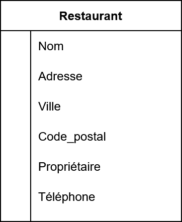
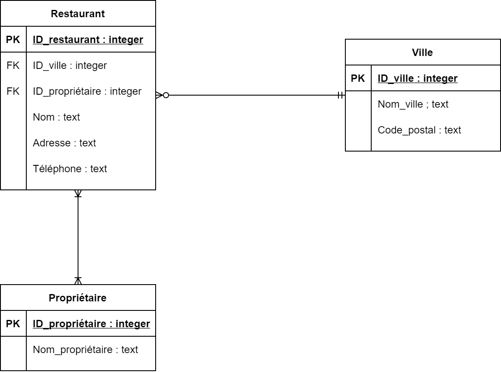
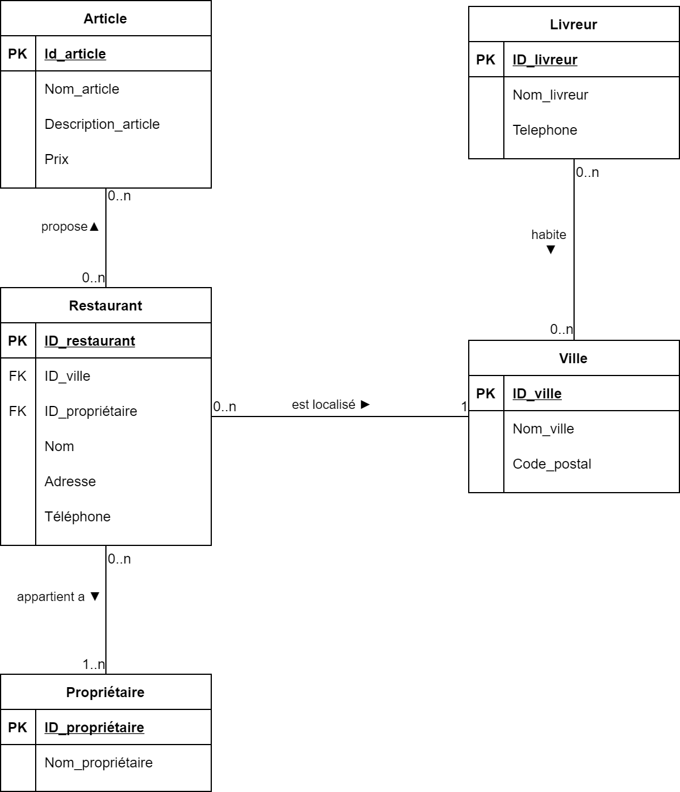
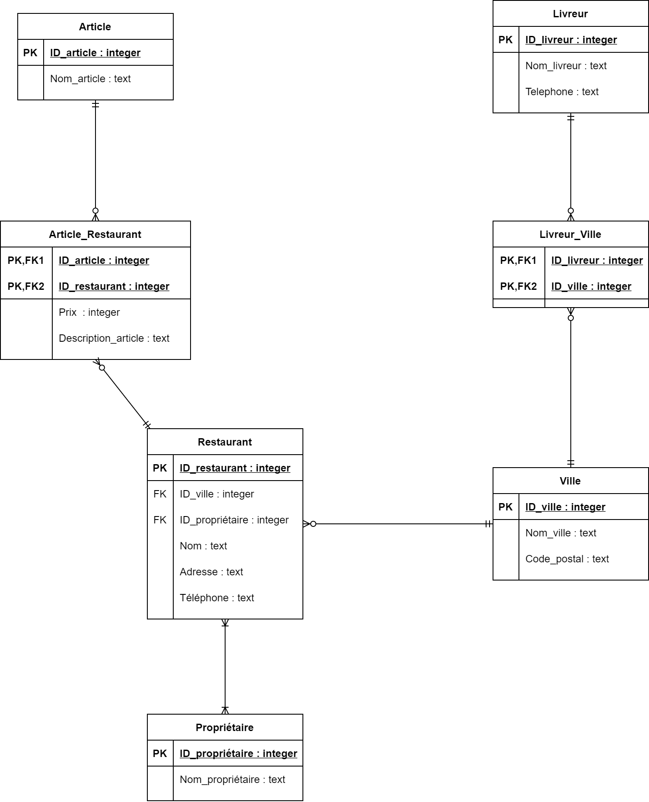

# TD création base de données et formes normales

Le but de ce TD est la mise en place d'une base de données pour un système de livraison de restauration type Uber Eat où Deliveroo. La contrainte est de respecter les 3 premières formes normales et celle de Boyce-Codd.

## Exercice 1 : la table restaurant

Voici une proposition de table `Restaurant` qui devra contenir les informations des restaurants. Cette table vous semble-elle juste ? Avez-vous des proposition d'amélioration ?



Problèmes et corrections associées :

- Pas de clef primaire. On pourrait considérer le couple (Nom, Adresse) mais on va préférer un ID technique
- Il manque le type de nos données
- Un restaurant peut avoir plusieurs propriétaires. Actuellement si on fait juste une liste cela enfreint la première forme normale
- La ville et le code postale sont liés. Cela enfreint la 3 NF


Proposition de solution :



- On peut discuter de la justesse de la table ville, actuellement cela n'est pas parfait, car une ville peut avoir plusieurs CP et un CP peut englober plusieurs villes, des idées ?
- On peut se demander pourquoi il n'y a pas de nom pour les associations. Ici on réalise un diagramme physique de base de données. On va faire apparaitre toutes les tables, et dans ce type de diagrammes on n'a pas besoin 

Un peu de SQL :

- Donnez une requête qui permet d'avoir tous les restaurants

  ````sql
  SELECT * 
  FROM Restaurant 
  ````

- Seulement 10

  ````sql
  SELECT * 
  FROM Restaurant
  LIMIT 10
  ````

- Seulement 10 par ordre alphabétique

  ````sql
  SELECT * 
  FROM Restaurant 
  ORDER BY Nom ASC 
  LIMIT 10
  ````

- Tous les restaurants d'une ville

  ````sql
  -- Version non optimisée
  SELECT *
  FROM Restaurant
  INNER JOIN Ville ON Restaurant.ID_ville = Ville.ID_ville
  WHERE Ville.Nom_ville = 'Rennes'
  
  
  -- Version optimisée, pourquoi cette version est meilleure ?
  SELECT *
  FROM Restaurant
  INNER JOIN 
  	(SELECT * FROM Ville  WHERE Nom_ville = 'Rennes') as v
  	ON Restaurant.ID_ville = v.ID_ville
  WHERE v.Nom_ville = 'Rennes'
  ````

- Seulement 10 restaurant d'une ville

  ````SQL
  SELECT *
  FROM Restaurant
  INNER JOIN 
  	(SELECT * FROM Ville  WHERE Nom_ville = 'Rennes') as v
  	ON Restaurant.ID_ville = v.ID_ville
  WHERE v.Nom_ville = 'Rennes'
  LIMIT 10
  ````

- Tous les restaurants de 10 villes seulement

  ````sql
  SELECT *
  FROM Restaurant
  INNER JOIN 
  	(SELECT * FROM Ville LIMIT 10) as v
  	ON Restaurant.ID_ville = v.ID_ville
  WHERE v.Nom_ville = 'Rennes'
  ````

- Le nom du propriétaire du restaurant qui a le numéro de téléphone "0123456789" 

  ````sql
  SELECT nom_proprietaire FROM
  	(SELECT ID_proprieraire 
  	FROM Restaurant
  	WHERE
  	telephone = '0123456789'
  	) as retaurant_filtered_by_tel
  INNER JOIN 
  	Proprieraire ON retaurant_filtered_by_tel.ID_proprieraire = Proprieraire.ID_proprieraire
  ````

  

## Exercice 2 : tables d'association

Vous recevez le modèle logique de données suivant, créez le modèle physique de données. Par modèle physique on entend un modèle qui représente l'intégralité des tables nécessaires aux bon fonctionnement de votre base. Ne vous concentrez pas sur le formalisme (comment je représente mes tables) mais bien sur les tables manquantes.




Proposition de correction :



Un peu de SQL :

- Donnez une requête pour avoir tous les articles proposé par le restaurant "Le Trevis"

  ````sql
  SELECT nom_article, prix, description_article
  FROM Article
  INNER JOIN Article_Restaurant ON Article.ID_article = Article_Restaurant.ID_article
  INNER JOIN Restaurant ON Article_Restaurant.ID_restaurant = Restaurant.ID_restaurant
  WHERE restaurant.nom = 'Le Trevis'
  
  
  -- On peut optimiser cette requête
  SELECT nom_article, prix, description_article
  FROM Article
  INNER JOIN Article_Restaurant ON Article.ID_article = Article_Restaurant.ID_article
  INNER JOIN (
      SELECT ID_restaurant
  	FROM Restaurant
  	WHERE nom = 'Le Trevis') as restaurat_filtered_by_name ON Article_Restaurant.ID_restaurant = restaurat_filtered_by_name.ID_restaurant
  ````

- Donnez une requête pour avoir le nombre d'article proposé par le restaurant "Le Trevis"

  ````sql
  SELECT COUNT(1)
  FROM Article_Restaurant ON Article.ID_article = Article_Restaurant.ID_article
  INNER JOIN (
      SELECT ID_restaurant
  	FROM Restaurant
  	WHERE nom = 'Le Trevis') as restaurat_filtered_by_name ON Article_Restaurant.ID_restaurant = restaurat_filtered_by_name.ID_restaurant
  ````

- Donner une requête pour avoir le nombre d'articles proposés par chaque restaurant

  ````sql
  SELECT COUNT(1)
  FROM Article_Restaurant ON Article.ID_article = Article_Restaurant.ID_article
  INNER JOIN Restaurant  ON Article_Restaurant.ID_restaurant = Restaurant.ID_restaurant
  GROUP BY Restaurant.ID_restaurant
  ````

  