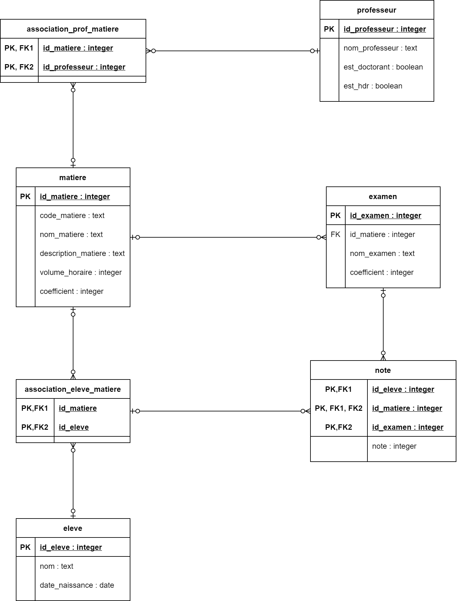

# Exercice de requêtage SQL

## 0. Mise en place

Connectez vous à la page [moodle](https://foad-moodle.ensai.fr/course/view.php?id=39) du cours et téléchargez le fichier [init_base_eleve.sql](https://foad-moodle.ensai.fr/mod/resource/view.php?id=3607). Connectez vous à la base de données PostgreSql de l'école (ent> application >postgreSQL>serveurs>PostgresSQL). Votre identifiant et votre mot de passe sont tous les deux votre identifiant de l'ensai, idXXXX. Trouvez votre identifiant dans la liste qui s'affiche (utilisez la fonction de recherche avec `ctrl+f`), cliquez dessus et cliquez sur SQL. Copiez collez le contenu du script initialisation en pensant à désactiver l'option "paginer les résultat" qui se trouve au dessus du bouton "Lancer".

## 1. Etude de la base

Voici le digramme de base de données physique de la base que vous venez d'importer :

C'est une base type base de scolarité qui permet de gérer une école. On retrouve 4 concepts clefs, les matières, les professeurs, les élèves et examen avec leurs notes. 

### Exercices :

1.1 À combien de matière un élève peut-il est associé ?

1.2 Même question pour professeur et matière.

1.3 Même question pour examen et matière.

1.4 Même question pour note et élève ?

1.5 Expliquez pourquoi la base ne permet pas de répertorier la note d'un examen associé à une matière à laquelle un élève n'est pas associé.

## 2. Requêtes de lecture

Rédigez les requêtes qui permettent d'afficher :

- L'intégralité de la table `matiere`
- 10 lignes de la table `matiere`
- La description de la matière avec le code_matiere `1ASTA01`
- Tous les professeurs avec un doctorat mais pas d'hdr
- Tous les cours associé au professeur `Charles Savel`
- Tous les élèves associé au cours `1AINF05`
- Le nombre d'élèves associé au cours `1AINF05`
- L'âge de tout les élèves
- L'écart d'âge entre l'élève le plus jeune et le plus vieux.
- La plus haute note obtenue à un examen tout examen confondu (les notes sont générées aléatoirement alors cette valeur peut varier d'une base à l'autre)
- Le nombre d'examen associé à la matière `Statistique avec R`
- La moyenne de l'élève `Avice Vadeboncoeur`

## Requêtes d'écriture

Rédigez les requêtes qui permettent de modifier les données existantes :

- Ajouter une matière :
  - code_matiere : 1AINF06  
  - nom_matiere : Projet Traitement de données
  - description_matiere : L’objectif est de mettre en pratique sur un cas concret tous les aspects de l’enseignement d’introduction
    à la programmation orientée objet et à la documentation de code.  
  - volume_horaire : 42
  - coefficient : 2

- Ajouter un professeur : 
  - nom_professeur : Anas Knefati  
  - est_doctorant : True
  - est_hdr : False
- Lier les professeurs  Anas Knefati  et Rémi Pépin à la matière Projet Traitement de données
- Changer le nom de l'élève avec l'id_eleve 10 en Anais Frechet
- Ajouter 1 points au note de l'exam 5

